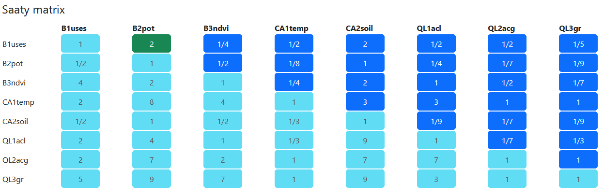
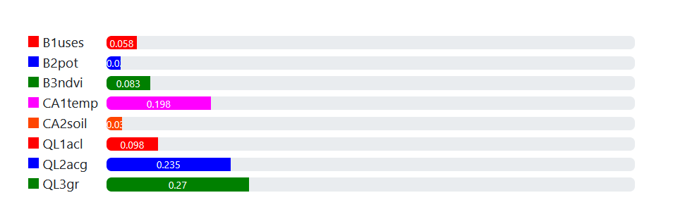
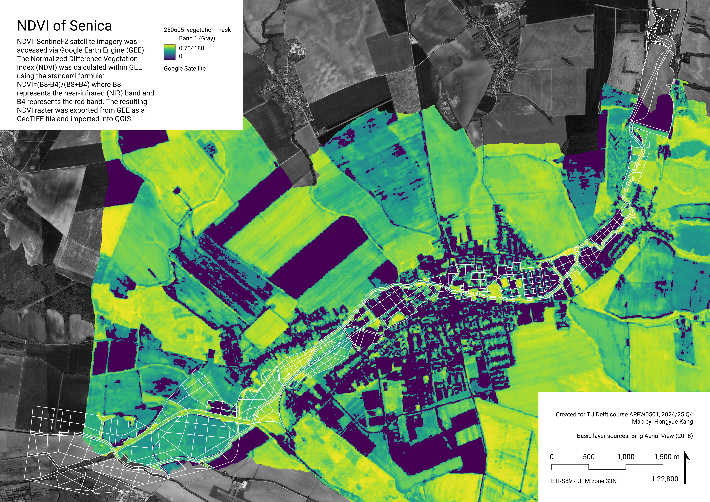
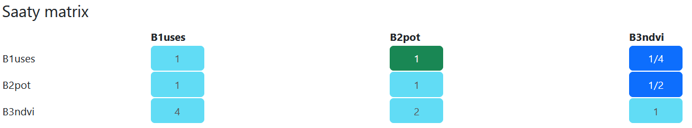
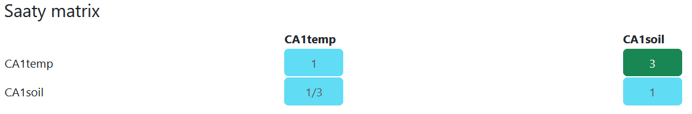
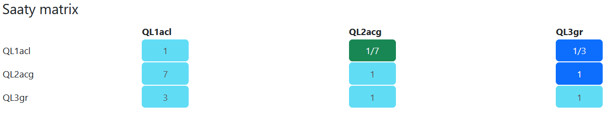

<!-- ::: callout -->

<!-- ## This is a computational notebook -->

<!-- Quarto enables you to weave together content and executable code into a finished document. To learn more about Quarto see <https://quarto.org>. -->

<!-- ## Running Code -->

<!-- When you click the **Render** button a document will be generated that includes both content and the output of embedded code. You can embed code like this: -->

<!-- ```{r} -->

<!-- 1 + 1 -->

<!-- ``` -->

<!-- You can add options to executable code like this  -->

<!-- ```{r} -->

<!-- #| echo: false -->

<!-- 2 * 2 -->

<!-- ``` -->

<!-- The `echo: false` option disables the printing of code (only output is displayed). -->

<!-- You can delete this entire callout between and including the lines -->

<!-- ``` -->

<!-- ::: callout -->

<!-- ``` -->

<!-- and -->

<!-- ``` -->

<!-- ::: -->

<!-- ``` -->

<!-- and start the report from the Introduction section below. -->

<!-- ::: -->

## Introduction

***How to approach stream restoration so that it gives place for desired urban and community facilities, as well as improving biodiversity, ecological connectivity, and water retention in the landscape?***

This report presents a spatial Multi Criteria Data Analysis and Typology Construction to determine possibilities for restoration of the Teplica river in the town Senica (Slovakia).

Note: This is student work created as part of the Applied Spatial Analysis for Sustainable Urban Development course at TU Delft.

Note #2: THIS IS A WIP, IT WILL BE FINALISED IN END OF JUNE 2025.

##### Key words:

Urban Stream Restoration, Biodiversity, XXXX, XXXX


### Colophon

#### Students – roles and contributions

Hongyue Kang (MSc Urbanism) – Presentation Lead, Data Analyst (microclimate analysis, NDVI)

~~Jiaoyang Wu (MSc Geomatics) – Data Analyst, Mapping Specialist (flood risk)~~

Kelly Schoonderwoerd (MSc Geomatics) – Editor, Data Analyst (surface temperature), R Expert, Clustering Lead

Viola Ebermannová (MSc Urbanism) – Project Coordinator, Research Lead, Design Lead (graphic guidelines and layout templates), Data Analyst (analysis geometry, space syntax analysis), MCDA Lead

#### Course information

Created as part of the course: ARFW0501 Applied Spatial Analysis for Sustainable Urban Development (2024/25 Q4), Faculty of Architecture and the Built Environment.

Tutors: Dr. Daniele Cannatella, Dr. Claudiu Forgaci, Yehan Wu, PhD

In collaboration with the [ReBioClim](www.interreg-central.eu/projects/rebioclim/) project.

## Methods

<!--# add intro!!! -->

### Reproducibility self assessment

<!-- Based on reproducibility seminar and the checklist linked in the presentation. -->

## MCDA

::: callout
Multi Criteria Decision Analysis is a research style that advises decision making based on evaluation of multiple objectives and criteria. It aims to formalize problems and evaluate them by mathematical means. <!-- Do we need a source? -->
:::

### Selection of objectives and criteria – three pillar system

<!--Add diagrams and text describing the approach to create objectives, research questions and subquestions -->


#### Detailed research structure

{height="100%" width="100%" src="path-to-pdf"}

```{=html}
<iframe src="pdf/ResearchStructure_20250610.pdf" width="100%" height="500" frameborder="0" />
</iframe>
```

```{=html}
<iframe src="pdf/ResearchStructure_20250610.pdf" width="100%" height="500" frameborder="0"></iframe>
```

</iframe>

<!-- ::: {#fig-resstr} -->

<!-- <iframe src="pdf/ResearchStructure_20250610.pdf" width="100%" height="500" frameborder="0" /> -->

<!-- Research structure XXX -->

<!-- ::: -->

#### Weighting

We weighted the criteria for MCDA with a pairwise comparison matrix (Saaty matrix) using [Fuzzy AHP](https://fuzzyahp.holecekp.eu/en/info) by Pavel Holeček. The complete matrix looks like this:



The weights are assigned as follows. Overall, highest weights were assigned to CA1temp (targetting cooling down summer surface temperature) and QL2acg (potential for central urban functions) and QL3gr (need of built up area for green). Criteria that scored high directly influence livability offer a very actionable basis for the public sector and show potential for feasible and well advocatable investments.

| Criterion | Weight |
|-----------|--------|
| B1uses    | 0.058  |
| B2pot     | 0.027  |
| B3ndvi    | 0.083  |
| CA1temp   | 0.198  |
| CA2soil   | 0.03   |
| QL1acl    | 0.098  |
| QL2acg    | 0.235  |
| QL3gr     | 0.27   |

: Weights of MCDA criteria



Consistency is acceptable with consistency ration CR = 0,086 :

| λmax = 8.847
| CI = 0.121
| RI = 1.4
| CR = 0.086

### Analysis geometry

The analysis geometry is a vector polygon layer consisting of morphologically determined elements. The decision to create geometry tailored to the local spatial conditions has two main reasons:

1.  to make the analysis more accessible to locals – through analysing on geometry familiar to them, hopefully making interpretation easier, and
2.  to make the results more actionable – through analysing on logical spatial units results will be more space-specific

At the core is a *Regional biocorridor* as indicated in *Spatial Ecological Stability System* (*ÚSES*) – an approximately 20 meter buffer around the stream. We differentiate left and right bank, because it matters for accessibility (significant for all attributes in quality of life).

The bounds of the analysis geometry were determined based on the floodplain of the river indicated by flood danger maps. This is the area that "belongs" to the river, thus it should be restored together with the watercourse. (The outline was based on raster data available online and spatial logic of the area to respect natural boundaries.)

The flood plain was partitioned based on local morphology and land cover, and in some cases inspired by the parcellation structure to create a smaller grain in areas with large unpartitioned fields.


#### Analysis geometry update after 27. 5. consultation

Cells along the river: i went through it manually and merged some cells to create larger areas. Always merged only the ones that i previously classified as the same landcover. I did it based on spatial logic and continuity of surrounding division lines. Left and right bank is still distinguished.

Other cells: In few places, i simplified field separation and merged a road into it (where there is no significant different type of land cover along the road.)

*- Viola*


#### Land cover classification

The analysis geometry was manually assigned Land Cover classes. Below is an overview of these classes with a typical example. Each land cover class was assigned an estimate ecological quality indicator based on intuition.


### Data structure

<!--Talk about how we deal with data, sources, what geometries we use for what and how overview of approaches to agregate data from original geometry types to the analysis geometry -->

General workflow of aggregating data is: 0. Perform calculations and create base layer 1. Normalise values 2. Aggregate (3. Eventually normalise again)

We use linear min-max normalisation to 0-1, eventually inversed (1-\[standard min-max normalisation\]).

WIP - please refer to detailed research structure flowchart for some information.


### Biodiversity

<!--# intro -->

***How to improve local and supra local biodiversity resilience by interventions within the stream flood plain? -\> which spaces to prioritize based on value and feasibility of intervention***

WIP – please refer to the main research structure flow chart for overview.

#### #1 Which spaces should be prioritised because of their connectivity to ÚSES?

##### Data

###### What is ÚSES?

Územný systém ekologickej stability (ÚSES) (Spatial system of ecological stability) is a system of spatial units intended to securing the ecological stability of Slovakian landscape, connecting natural areas, and protection of biotopes and representative species in their natural habitats. It is a legally anchored documentation (Act No. 543/2002 Z. z. – About the protection of nature and landscape).

The elements of ÚSES are biocenters, biocorridors (connecting biocenters to allow for movement of organisms and genetical information exchange), and interaction elements (spatially tied with biocorridors). These elements are defined on supraregional, regional, and local scale.

(SAŽP n.d.)

###### ÚSES within our area


##### Aggregation and normalisation

Values were assigned based on the level of connectivity to ÚSES. Highest value was assigned to polygons intersecting with ÚSES elements, polygons that are connected by continuous green land cover (as defined in Land Cover general type of landcover) were also assigned a slight priority.

| polygons in which ÚSES elements are present --\> 1
| polygons that are connected by (contuinuos) "green" land cover to ÚSES elements --\> 0,3
| other polygons --\> 0


#### #2 Which spaces should be prioritised based on ecological quality improvement potential?

Our argument is that spaces with a potential for a high impact improvement and at the same time good investment feasibility should be prioritised, because of good actionability of intentions/plans.

Potential for high impact improvement is determined by unsatisfactory ecological quality. Investment feasibility is determined by attractivity to invest in biodiversity improvement and in general spatial quality improvement in an area like this. High investment feasibility is in the surrounding of dwellings, in spaces that are already upkept. Low investment feasibility is in agricultural areas, where produce is prioritised. In these areas in general it is advised to use agricultural methods that can aid local biodiversity.


##### Aggregation and normalisation

The potential was calculated on range 0-1 directly on Analysis geometry polygons.


#### #3 Which spaces should be prioritized based on current state of the vegetation?

##### NDVI

The steps we take to calculate the NDVI are as follow: Sentinel-2 satellite imagery was accessed via Google Earth Engine (GEE), covering the study area during the growing season to ensure accurate vegetation representation. The Normalized Difference Vegetation Index (NDVI) was calculated within GEE using the standard formula: NDVI=(B8-B4)/(B8+B4) where B8 represents the near-infrared (NIR) band and B4 represents the red band. The resulting NDVI raster was exported from GEE as a GeoTIFF file and imported into QGIS. In QGIS, the NDVI layer was reprojected, clipped to the study boundary, and further analyzed using raster statistics and classification to evaluate vegetation cover across different spatial units along the Teplica River. Based on the different value of NDVI mean, we can deduce the vegetation state in each spatial geometry.

| **\< 0** – Water bodies, shadows, or noise
| **0–0.1** – Bare soil or urban hardscape
| **0.1–0.3** – Sparse or dry vegetation
| **0.3–0.6** – Moderate vegetation
| **\> 0.6** – Dense and healthy vegetation



##### Aggregation and normalisation

Data was aggregated based on average value within analysis geometry polygon, and normalised by 1-\[linear min-max\] –\> priority is given to low quality vegetation.


#### Weighting

An overall pairwise comparison matrix was created for all indicators at once (see more above). For comparing biodiversity criteria among each other, the values were given as follows:



The calculated weights for biodiversity indicators are:

| Criterion | Weight |
|-----------|--------|
| B1uses    | 0.058  |
| B2pot     | 0.027  |
| B3ndvi    | 0.083  |

: Weights of biodiversity criteria

#### Biodiversity conclusion

<!--# some text  conclusion is needed here -->
In this part, we developed a spatially explicit composite biodiversity index map for the spatial geometry by integrating three indicators: NDVI, USES (spatial system of ecological stability), and POT (ecological quality improvement potential). Because we agree that vegetative cover remains a dominant factor influencing riparian biodiversity, in line with existing ecological connection, we assigned NDVI with the highest weight (0.083), followed by USES(0.058) and POT(0.027). At last we generated a composite map reflecting biodiversity improvement potential along the Teplica.

The resulting map reveals a clear spatial pattern: because of NDVI and USES’s high weight, area with high improvement potential are those where have low NDVI index and are less connected with USES, particularly in the midstream and upstream sections. 


### Climate adaptation

***How to use areas in the flood plain to capture water in the landscape? -\> where is good space for infiltration basins and natural flood protection measures based on soil types, and where is space for (wet) cooling measures?***

<!--# intro -->

<!-- The question needs to be more specific and based in data – what are examples of interventions that can achieve this? How much space do they need? -->

WIP – please refer to the main research structure flow chart for overview.

This chapter is based on the fact that in western slovakia, there is a large drought problem, and water management activities should target capturing water in the landscape. <!-- ^This needs a source, but it is true. -->

#### #1 Which spaces should be prioritized for interventions aimed at cooling the area down?

To analyse surface temperatures, we found a [Google Earth Engine script](https://code.earthengine.google.com/ac986028b56a794aefd3ea54e9cb09ba) made by [Ramadhan](https://www.youtube.com/watch?v=3LOMNzBHmjs) on YouTube (2024) that uses information from Sentinel-2, LANDSAT, and DEM to predict a raster LST (land surface temperature) with a higher resolution than other available datasets on LST, namely 10-meter resolution. The computations are complicated and will only be discussed in general lines in this report, but the results are relevant and useful to our research. Mainly to answer the question of which spaces should be prioritized to be wetter to help the area cool down, because now it is too hot. The draft image shows the results for dates 2024-06-01 to 2024-08-31, since these three months include the summer and will therefore be most susceptible for heat stress, which makes this time period interesting to look at for our research.

The method uses the different datasets to extract several attributes (e.g. B2, B3, elevation, slope, wetness, greenness, dryness, etc.). Together with the recorded LST data, a correlation between attributes and LST is calculated. For the six attributes with the highest correlation, the average correlation matrices are computed and the three lowest correlation matrices are used to set up a model. The model is then trained with test data to predict LST based on the provided correlation information. Then, the model is applied to data in the area of interest to create a dataset with LST predictions that covers the full area in detail (instead of the available recorded LST datasets with big gridcells). 

The Google Earth Engine (GEE) script was adapted to analyse our area of interest (Senica and surroundings) and an interesting time period as mentioned earlier. The code produced a GeoTiff file that we downloaded for further processing. The LST values in this file are given in degrees Celsius and range from 27-38. The raster GeoTiff file was combined with our analysis geometry layer using the 'zonal statistics' tool in QGIS. This resulted in a vector layer with our analysis polygons, including a column in the attribute table representing the mean value of the LST raster layer inside that specific polygon. This value represents the aggregation of LST values, which was then normalized with the following statement in the field calculator:

```         
1 - (maximum("_mean") - "_mean") / (maximum("_mean") -  minimum("_mean"))
```

The normalization is a linear min-max normalization for a benefit criterion, meaning that areas with a higher LST should be prioritized for improvements and development. A lower LST would be desirable and thus has less need for spatial developments to improve LST, which is represented in lower normalization values (closer to 0).

```{=html}
<!-- General steps (DRAFT):

* Use GEE code (reference properly) 
* Download GeoTiff 
* Use zonal statistics
* Combine raster layer with combined polygons using zonal statistics tool 
* This results in onder andere the mean column 
* Use mean (aggregation) to normalise: (maximum("_mean") - "_mean") / (maximum("_mean") -  minimum("_mean"))
* The lower the LST, the better and thus the higher norm value (closer to 1 for lower LST) 
* Clean up and rename, save as separate file for further processing -->
```


##### Weigting and normalisation

Weighted as mean by Zonal statistics tool.


#### #2 Where does the soil have high potential for water retention?

##### Soil retention ability and permeability

From Atlas of Slovakia, quite small scale.

Soil retention in this map means ..... Permeability means ....


##### Aggregation and normalisation

| RS Medium+ P Medium -\> 0,5
| RS High+ P Medium -\> 1


#### Weighting

An overall pairwise comparison matrix was created for all indicators at once (see more above). For comparing climate adaptation criteria among each other, the values were given as follows:



The calculated weights for climate adaptation criteria are:

| Criterion | Weight |
|-----------|--------|
| CA1temp   | 0.198  |
| CA2soil   | 0.03   |

: Weights of climate adaptation criteria

#### Climate adaptation conclusion

<!-- some conclusion and interpretation text -->
For climate adaptation, we considered two key factors: land surface temperature (CA1temp) and water retention capacity (CA2soil). As shown in the resulting map, spatial geometries located within urban areas, as well as those near the downstream section of the Teplica River, are identified as more suitable for climate adaptation interventions. This outcome is primarily due to the significantly higher weight assigned to CA1temp, which has a more direct impact on climate adaptation potential. Consequently, areas currently experiencing higher land surface temperatures are prioritized as key targets for intervention.


### Quality of life

<!--# intro -->

***What types of places should be created in the stream flood plain?*** -\> Ammenities, green spaces, connections?

WIP – please refer to the main research structure flow chart for overview.

#### #1 Where is potential for community functions?

##### Angular choice analysis

<!-- explanation of what it shows and space syntax intro -->

On OSM street network, in area there are no clearly fast routes and there are missing pathways along some roads, so we took all roads from the dataset as potentially slow.

The values of Angular choice analysis with radius 500 m were lineary normalised to 0-1 range.

##### Weighting and normalisation

Aggregated as maximum value in polygon. Where there are no intersecting roads (gives result 'NULL'), 0 was assigned. This aggregate value was lineary normalised to 0-1 range.

```         
aggregate( 'layer: angular_choice', 'max', "attribute: r=500 m, normalised", intersects($geometry,geometry(@parent)))
```


#### #2 Where is potential for "central" functions?

Angular choice analysis was calculated for radii 1 km and 2 km. First, these two attributes were normalised. Then these values were combined to a common indicator, giving larger weight to the larger radius:

| AC1km2km = 1\*(AC r=1km) + 2\*(AC r=2km)

This attribute was then normalised.

##### Aggregation and normalisation

Again, the value was aggregated by calculating maximum value in the polygon and lineary normalised to 0-1 range.

```         
aggregate( 'layer: angular_choice', 'max', "attribute: AC1km2km, normalised", intersects($geometry,geometry(@parent)))
```

#### #3 Where is a large need for green?

##### Attraction reach analysis

explanation of what it calculates

Attraction reach was calculated from centroids of buildings to green areas, as classified in OSM, weighted by the area of the green area. Value was normalised.

##### Aggregation and normalisation

Analysis geometry polygons was buffered by 500 m, to simulate area in 500 m walking distance of each polygon. (While technically not 500 m walking distance, on this small scale we consider the difference negligible.)


Then, we filtered out houses that we consider "need green". Unfortunately, many houses in this area have "type" 'NULL', which skews the analysis.

```         
CASE
  WHEN
    "type" IS  NULL OR "type" IS 'apartments' OR "type" IS 'detached' OR "type" IS 'dormitory' OR "type" IS 'farm_auxiliary' OR "type" IS 'government' OR "type" IS 'house' OR "type" IS 'manor' OR "type" IS 'office' OR "type" IS 'public' OR "type" IS 'residential' OR "type" IS 'school' OR "type" IS 'semidetached_house'
    
  THEN 1
  
  ELSE 0

END
```


Then, for each buffered Analysis geometry polygon, sum was calculated of values from buildings in need of green intersecting it (value polygons with no intersecting buildings is zero).

```         
aggregate( 'layer: Buildings in need of green', 'sum', "Attraction reach to green areas, weighted by area, normalised", intersects($geometry,geometry(@parent)))
```

This was lineary normalised to 0-1 into the final value.


#### PLACEHOLDER SPACE SYNTAX base layers – UNTIL WE PUT IT IN CORRECT CHAPTERS

{height="100%" width="100%"}

Angular choice:

-   Every choice of path from every location to every destination – how many possible routes go through location

-   500 m

    -   very local scale, scale of children playing and shops on the corner even on this scale, there are some centralities along the river

    -   this means the river has a potential to be used by the community and act as a very local common space under social control

-   1000 m

    -   local scale of walking to shop or walking the dog

    -   paths along river do not have very low angular choice, hinting at them being possibly moderately frequented

    -   more centralities at bridges

-   2000m:

    -   close to the end of walkable scale

    -   some paths along river in the center have high angular choice, meaning they will likely be more frequented and have potential for active use and ammenities

    -   more centralities at bridges

{height="100%" width="100%"}

Attraction Reach Green space

-   What is the **reachable** potential **attraction density** of location (sqm)

    green areas weighted by area

-   500m:

    -   very local scale, scale of children playing and shops on the corner

    -   river and surroundings as potential new green areas to serve local scale in the west and north of the town

-   1000m:

    -   local scale of walking to shop or walking the dog

    -   river and surroundings as potential new green areas to serve local scale in the west and north of the town

-   2000m:

    -   close to the end of walkable scale

    -   center/east of town not having access to more large areas of green

{height="100%" width="100%"}

Attraction Reach Teplica

-   What is the **reachable** potential **attraction density** of location (sqm)

    measured to points every 5m of waterway

-   500m:

    -   very local scale, scale of children playing and shops on the corner

    -   Teplica quite well accessible from houses

    -   SW: industry is not so well connected

    -   SE: lacking connection between road parallel to river

-   1000m:

    -   local scale of walking to shop or walking the dog

    -   SW industry not allowing houses behind it to access river

    -   SE: still visible missing connection between parallel road and river

-   2000m:

    -   close to the end of walkable scale

    -   very similar to 1k

    -   SW: industry finally permeable, however this is quite a large distance and if the river and the way to it are not nice, there are no reasons to go

    -   W: the small village is not connected to a large path of the river, that is why it is lighter

    -   SE: still visible missing connection between parallel road and river

#### Weighting

An overall pairwise comparison matrix was created for all indicators at once (see more above). For comparing quality of life criteria among each other, the values were given as follows:



The calculated weights for climate adaptation criteria are:

| Criterion | Weight |
|-----------|--------|
| QL1acl    | 0.098  |
| QL2acg    | 0.235  |
| QL3gr     | 0.27   |

: Weights of climate adaptation criteria

#### Quality of life conclusion

<!-- text about conclusion and interpretation -->


### MCDA conclusion

<!-- text about conclusion and interpretation -->

We achieved the final conclusion by calculating the sum of all criteria for each polygon. This shows which areas have over all the greatest potentials and should be prioritised when making decisions on where to target urban stream restoration interventions. However, that does not mean that the areas with low priority should not be targeted. Sustainable stream restoration should be designed in a complex way, for the larger site (stream flood plain) as a whole.


## Typology construction

<!-- Kelly is working on this. -->

<!-- We feel like our goal for typology alligns pretty well with our main research question *How to approach stream restoration so that it gives place for desired urban and community facilities, as well as improving biodiversity, ecological connectivity, and water retention in the landscape?* -->

<!-- Hopefully, we will get types of areas that can make it easier to create example design interventions. Perhaps something like "areas with large potential for community facilities with water retention function", "areas with community functions and maintained high biodiversity", "areas with biodiversity boost, improved surface permeability and connectivity". -->

The typology construction is based on the course's provided tutorial on how to construct urban typologies in R. We use K-means Clustering, an unsupervised machine learning method, to find similar typologies for areas around an urban stream based on earlier analysed qualities. The main goal for the typological clustering is to get types of areas that can make it easier to create example design interventions. Perhaps something like "areas with large potential for community facilities with water retention function", "areas with community functions and maintained high biodiversity", "areas with biodiversity boost, improved surface permeability and connectivity". We feel like our goal for typology alligns pretty well with our main research question *How to approach stream restoration so that it gives place for desired urban and community facilities, as well as improving biodiversity, ecological connectivity, and water retention in the landscape?*

The focus area of the typology clustering is the stream corridor in Senica and the spatial unit is the earlier defined analysis geometries. For the typology clustering, we use four variables that were previously analysed, namely:

`B1uses` - Normalised scores based on the connectivity of an area to ÚSES (the regional ecological stability system).

`B3ndvi` - Normalised scores based on the current state of vegetation in an area, as indicated by the ndvi (Normalised Difference Vegetation Index).

`CA1temp` - Normalised scores based on the mean LST (Land Surface Temperature) of an area.

`QL2acg` - Normalised scores based on the potential of an area for "central" functions. Calculated by using high angular choice within polygons.

These specific attributes were chosen, because we judged them to be the most relevant for typology clustering. Both biodiversity attributes (B1uses and B3ndvi) give information about the areas and their current characteristics, making them useful for typology clustering. The other two attributes (CA1temp and QL2acg) got a high weight in the MCDA and are thus important to our research question. Another attribute that scored high in the MCDA is QL3gr, indicating spaces that lack green area within a radius of 500m. This attribute has been left out of the typology construction, since the presence and quality of green areas is already included in attribute B3ndvi and we judged B3ndvi to be more about the area itself than QL3gr, which takes into account the surroundings as well.

The dataset that is used, is an aggregated dataset containing all normalised attributes for each analysis geometry. The clustering steps can be generally described as follows:

Step 1. Load R packages and data\
Step 2. Standardization\
Step 3. Determine optimal k\
Step 4. Run K-means clustering\
Step 5. Interpret cluster center\
Step 6. (Optional) Calculate distance to cluster center

### Step 1. Load R packages and data

First, load the necessary R packages.

```{r}
#install.packages("sf") 
#install.packages("dplyr")
```

Next, load the required packages:

```{r}
library(sf) # for processing vector data 
library(dplyr) # for selecting and transforming data
library(tidyr) 
```

Read the dataset from the GeoPackage file and display the first few rows using head()

```{r}
grids <- st_read("data/Senica/analysisgeometry_aggregated_allattributes.gpkg", quiet = TRUE)

# View the first few rows of the data
head(grids)
```

We can check how many analysis geometries are in the file, in our case 600.

```{r}
# Count how many analysis geometries we have
nrow(grids)
```

To better understand the data we are working with, we can visualise it.

```{r}
# Plot B1uses
plot(grids["B1uses"], border = NA, main = "B1uses")

# Plot B3ndvi
plot(grids["B3ndvi"], border = NA, main = "B3ndvi")

# Plot CA1temp
plot(grids["CA1temp"], border = NA, main = "CA1temp")

# Plot QL2acg
plot(grids["QL2acg"], border = NA, main = "QL2acg")
```

### Step 2. Standardization

From the dataframe, we remove rows with missing (null/NA) values in one of the selected columns. This is needed to properly perform the clustering. We then select the relevant features (B1uses, B3ndvi, CA1temp, QL2acg). These features are standardised to ensure they contribute equally to the clustering algorithm.

```{r}
# remove rows with missing (null/na) values to continue clustering 
grids <- grids %>%
  drop_na(B1uses, B3ndvi, CA1temp, QL2acg)

features <- grids |> 
  select(B1uses, B3ndvi, CA1temp, QL2acg) |>
  st_drop_geometry() # remove geometry column so we just keep a data table
  
X_scaled <- scale(features) # Standardize (mean=0, sd=1) 

head(X_scaled)
```

### Step 3: Determine the optimal K

We use the **elbow method** to choose a good number of clusters.

For each value of `k` (e.g. 2 to 9), we run K-means and record a value called **inertia** : the total distance between points and their cluster centers. Lower inertia means tighter (better) clusters.

```{r}
# Initialize an empty numeric vector to store inertia values 
inertia <- numeric()

# Try k values from 2 to 9
k_values <- 2:9

# Loop through each k value
for (k in k_values) {
  km <- kmeans(X_scaled, centers = k, nstart = 20) 
  
  # tot.withinss is Total within-cluster sum of squares
  # This measures how compact the clusters are: lower is better.
  inertia <- c(inertia, km$tot.withinss)
}

# Combine the results into a data frame for plotting
elbow_df <- data.frame(k = k_values, inertia = inertia)

print(elbow_df)
```

The changing of inertia with increasing k is visualised and based on the *elbow point* we choose the best value for k. After this elbow point, adding more clusters does not add much to the quality of the end results.

```{r}
# Make the elbow plot
plot(k_values, inertia,
     type = "b",                  # shown both points + lines 
     col = "darkblue",
     main = "Elbow Method")
```

### Step 4. Run K-Means clustering

Looking at the elbow plot, there is not a very clear elbow point. However, to limit the amount of clusters so that we can later define clear typologies we choose `k = 4`.\
Now we run the K-means algorithm and assign each analysis geometry to one of the four clusters.

```{r}
# `set.seed()` sets the random number generator to a fixed state
# Set the seed so the clustering result is always the same when re-run
set.seed(0)  # The number 0 is just a fixed choice. You can also use 10, 345, etc.

# Choose the number of clusters based on the elbow plot
k <- 4

# Run K-means clustering on the standardized data
kmeans_result <- kmeans(X_scaled, centers = k, nstart = 20)
#print(kmeans_result)

# Add the cluster labels to the spatial data
grids$cluster <- as.factor(kmeans_result$cluster) # The result kmeans_result$cluster is a list of cluster labels (1 to 4), in the same order as the original rows in X_scaled and grids

head(grids)

# Show how many grids fall into each cluster
print(table(grids$cluster))
```

Save the updated analysis geometry data (with a column indicating clusters) to a new GeoPackage file for further analysis and visualisation.

```{r}
#st_write(grids, "analysisgeom_aggregated_cluster02.gpkg")
```

We can also visualise it directly.

```{r}
# Plot clusters with base R
plot(grids["cluster"], 
     main = "Spatial Pattern of Urban Stream Clusters", 
     border = NA)
```

### Step 5. Interpret cluster centers

Now we look at the center of each cluster. First, we check the values in standardized form. Then, we convert them back to the original units, so they are easier to understand.

```{r}
# Get the cluster centers (in standardized form)
scaled_centers <- kmeans_result$centers

# Print them
print("Cluster centers (standardized):")
print(scaled_centers)

# Convert the centers back to original scale: x * SD + mean
original_centers <- t(apply(
  scaled_centers, 1,
  function(x) x * attr(X_scaled, "scaled:scale") + attr(X_scaled, "scaled:center")
))

# Print the real-world values
print("Cluster centers (original):")
print(original_centers)

```

To interpret the clustering results, we examine the centers of each cluster in the original data scale. The table below shows the unscaled clustered values of each attribute.

### Typology description

| Type | B1uses | B3ndvi | CA1temp | QL2acg | Description |
|------------|------------|------------|------------|------------|------------|
| 1 | 0.417 | 0.742 | 0.778 | 0.708 | High B3ndvi, CA1temp, and QL2acg. Low B1uses. |
| 2 | 0.747 | 0.300 | 0.386 | 7.216e-16 | High B1uses and extremely low QL2acg |
| 3 | 0.781 | 0.286 | 0.442 | 0.792 | High B1uses and QL2acg |
| 4 | 0.545 | 0.301 | 0.837 | 0.0177 | High CA1temp and low QL2acg |

### Step 6. (Optional) Calculate distance to cluster center

Optionally, we can compute the distance of each analysis geometry to the cluster center. This can be used as an indication of how well the geometry fits in its cluster, thus how closely an individual geometry resembles the general typology it is categorised in.

```{r}
## Step 6 (Optional): Compute distance to cluster center

# Get the cluster center for each row, using the cluster assignment
centroids_matrix <- kmeans_result$centers[kmeans_result$cluster, ]

# Calculate Euclidean distance between each point and its assigned cluster center
grid_distances <- sqrt(rowSums((X_scaled - centroids_matrix)^2))

# Save to grids
grids$cluster_dist <- grid_distances

head(grids$cluster_dist)

```

## Results

## Discussion

### Discussion of results

## Reflection

```{=html}
<!-- Notes for reflection
    - limitation with layer selection – abilities, time management, ...
    - what would be good to also include
    - analysis geometry (suitability, methodology, scale) – this might also be in discussion, at least partly
  -->
```

## Conclusion

## Appendix

<!--# layers and analyses we didnt use but would be shame not to include  -->

 

## Sources

<!-- Use APA 7 - full here, bracketed in text and maps (for some i used the full version in the image for easier referencing) -->

<!-- we could also make the bracketed versions and the full references linked -->

### Literature

SAŽP. (n.d.). Územný systém ekologickej stability (ÚSES). SAŽP – Slovak Environment Agency. Retrieved on June 6, 2025 from <https://www.sazp.sk/zivotne-prostredie/starostlivost-o-krajinu/zelena-infrastruktura/uzemny-system-ekologickej-stability-uses>

### Map layers

### Images

Street View of Senica – Google Maps. (May 2012). Retrieved on May 22, 2025 from: [https://www.google.com/maps/place/905+01+Senica,+Slovensko/\@48.6841521,17.3581313,3a,75y,296.73h,88.04t/data=!3m7!1e1!3m5!1sbkMc3aSUkJxRvi5IszgGWg!2e0!6shttps:%2F%2Fstreetviewpixels-pa.googleapis.com%2Fv1%2Fthumbnail%3Fcb_client%3Dmaps_sv.tactile%26w%3D900%26h%3D600%26pitch%3D1.9640483562330928%26panoid%3DbkMc3aSUkJxRvi5IszgGWg%26yaw%3D296.73281886129774!7i13312!8i6656!4m7!3m6!1s0x476cb4e2e7ed1a27:0x400f7d1c696ee40!8m2!3d48.6811502!4d17.3672337!10e5!16zL20vMGRyeG43?entry=ttu&g_ep=EgoyMDI1MDUyMS4wIKXMDSoASAFQAw%3D%3D](https://www.google.com/maps/place/905+01+Senica,+Slovensko/@48.6841521,17.3581313,3a,75y,296.73h,88.04t/data=!3m7!1e1!3m5!1sbkMc3aSUkJxRvi5IszgGWg!2e0!6shttps:%2F%2Fstreetviewpixels-pa.googleapis.com%2Fv1%2Fthumbnail%3Fcb_client%3Dmaps_sv.tactile%26w%3D900%26h%3D600%26pitch%3D1.9640483562330928%26panoid%3DbkMc3aSUkJxRvi5IszgGWg%26yaw%3D296.73281886129774!7i13312!8i6656!4m7!3m6!1s0x476cb4e2e7ed1a27:0x400f7d1c696ee40!8m2!3d48.6811502!4d17.3672337!10e5!16zL20vMGRyeG43?entry=ttu&g_ep=EgoyMDI1MDUyMS4wIKXMDSoASAFQAw%3D%3D)
