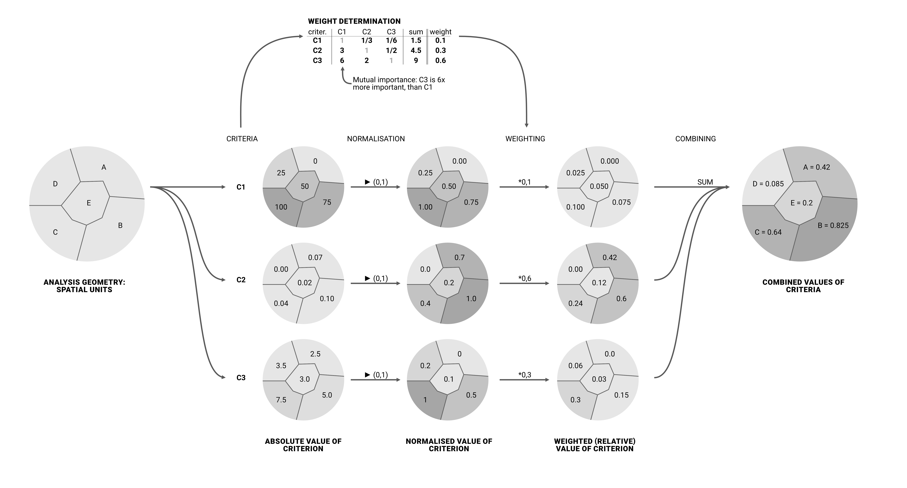
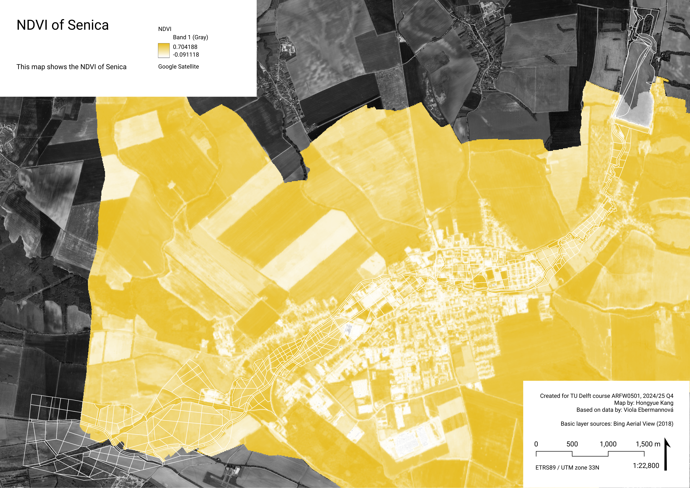
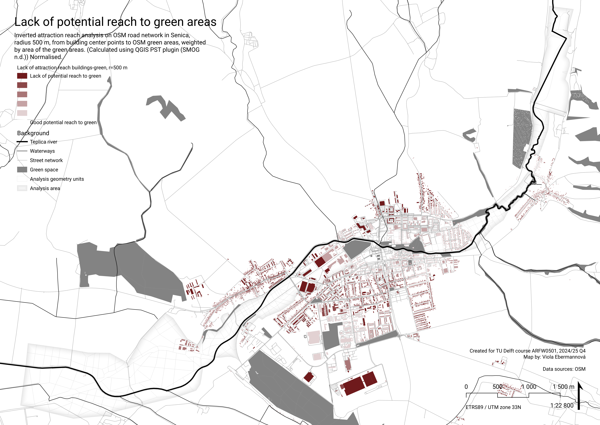
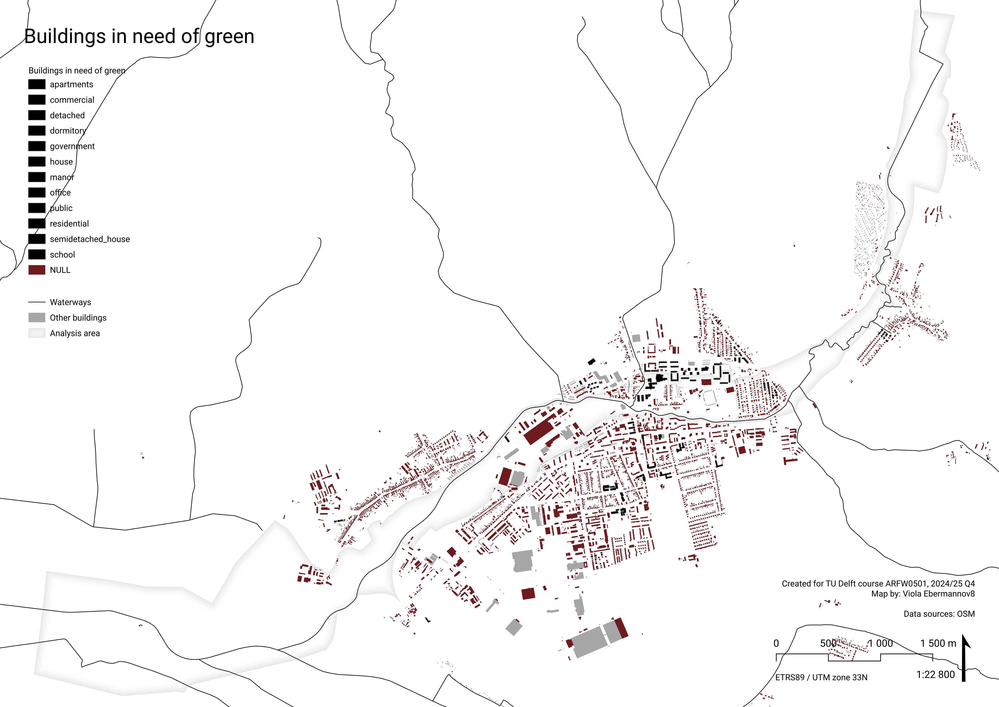

<!-- ## This is a computational notebook -->

<!-- This report was created using Quarto. To learn more about Quarto see <https://quarto.org>. -->

## Introduction

***How to approach stream restoration so that it gives place for desired urban and community facilities, as well as improving native biodiversity, ecological connectivity, and water retention in the landscape?***

This report presents a spatial Multi Criteria Data Analysis and Typology Construction to determine possibilities for restoration of the Teplica river in the town Senica (Slovakia).

Note: This is student work created as part of the Applied Spatial Analysis for Sustainable Urban Development course at TU Delft.

Note #2: THIS IS A WIP, IT WILL BE FINALISED IN END OF JUNE 2025.

##### Key words:

Urban Stream Restoration, Sustainability, Multi Criteria Decision Analysis, Typology Construction, K-means clustering, Senica, Slovakia


### Colophon

#### Students – contact, roles and contributions

Hongyue Kang (MSc track Urbanism, BK TU Delft, hongyuekang\@tudelft.nl) – Presentation Lead, Data Analyst (microclimate analysis, NDVI)

Kelly Schoonderwoerd (MSc Geomatics, BK TU Delft, K.R.Schoonderwoerd\@student.tudelft.nl) – Data Analyst (surface temperature), R Expert, Clustering Lead

Viola Ebermannová (MSc track Urbanism, BK TU Delft, v.ebermannova\@student.tudelft.nl) – Project Coordinator, Research Lead, Design Lead (graphic guidelines and layout templates), Data Analyst (analysis geometry construction, space syntax analysis), MCDA Lead

#### Course information

Created as part of the course: ARFW0501 Applied Spatial Analysis for Sustainable Urban Development (2024/25 Q4), Faculty of Architecture and the Built Environment.

Tutors: Dr. Daniele Cannatella, Dr. Claudiu Forgaci, Yehan Wu, PhD

In collaboration with the [ReBioClim](www.interreg-central.eu/projects/rebioclim/) project.

### Introduction of the case, problem statement, and objectives

Teplica is a small river flowing through the town of Senica, it is a tributary of the river Myjava in the Morava River basin (tributary of Danube, Black Sea drainage basin.) Senica lays in western Slovakia, it is a municipality with a slightly shrinking population of just under 20 000 inhabitants. (Mesto Senica 2025)

The stream is now not integrated well into the urban fabric of Senica, often hidden in a jungle of high dense vegetation and flowing significantly lower than the surrounding area, acting as a barrier. This means the inhabitants cannot make use of the benefits an urban stream might bring to a town, such as improved recreation opportunities and communal and urban facilities benefiting from the location at the riverbank.

In a large portion of the stream, the riverbed was straightened and artificially reinforced. This leads to decreased water retention in the landscape, contributing to (soil) drought, and decreasing the cooling potential of the stream area. Moreover, it decreases the flood protection ability of the stream bed by not providing natural flood spillage areas, directing water directly downstream.

The stream corridor is an official biocorridor defined in the Slovakian Spatial System of Ecological Stability (ÚSES), a chain of ecosystems allowing for ecological flows. Right now, only the small footprint of the artificial banks is consistently covered by “natural” vegetation. This vegetation might technically be biodiverse, however the thin artificial riverbed leads to valuable natural floodplain ecosystems missing.

***How to approach stream restoration so that it gives place for desired urban and community facilities, as well as improving native biodiversity, ecological connectivity, and water retention in the landscape?***

This project is a spatial analysis of the stream flood plain highlighting the potentials for interventions targeting the topics of quality of life, biodiversity, and climate adaptation. It also proposes categorisation of spaces based on characteristics connected to the topics aiming at the simplification of visioning and design process of urban stream restoration interventions.

## Methods

To determine the potentials for sustainable urban stream restoration interventions, we use Multi Criteria Decision Analysis. This analysis method offers an evidence-based evaluation of the suitability of area for intervention targeting different objectives based on predefined quantified criteria. (See chapter [MCDA].)

To construct typologies of spaces based on biodiversity, quality of life, and climate adaptation characteristics we use k-means clustering. We use selected quantified criteria to discover patterns in how they combine in the flood plain area spaces. These typologies offer a simplified look at the area, being a good base for model examples of typical interventions. (See chapter [Typology construction].)

For both approaches, we perform the analysis on morphologically defined spatial units, which were tailor-made for the flood plain of Teplica in the municipality of Senica. (See chapter [Analysis geometry].)

The attributes/criteria we selected to represent the characteristics of spaces in the river flood plain are described in the chapter [Selecting objectives and criteria – three pillar system](#selecting-objectives-and-criteria-three-pillar-system). We used all these criteria for MCDA analysis, and chose four of them for the typology construction.

Spatial analysis was conducted and maps produced by [QGIS](https://qgis.org/), an open source GIS (Geographic Information System) software, including the [PST plugin](https://smog.chalmers.se/projects/pst-plugin-for-qgis/) (SMOG n.d.). Typology construction was conducted through R scripts directly in the report file. Some data was accessed and analysed through Google Earth Engine.

### Reproducibility self assessment

This reproducibility self assessment is based on the ReproducibilityChecklist.md file (in main directory).

Project documentation is up to the checklist standards (README files in subfolders could be more detailed). Data availability could be improved by separating raw and aggregated data and provided proper descriptions of file structure and attributes, as well as citation information. The data does use open formats (.gpkg). We used open software to conduct analyses, but some graphic work was done in paid graphic software. The version numbers of software should be listed (it is possible we did not used the same versions within the team.)

The workflow is documented quite clearly, although in some parts the reproducibility is limited (subjectively assigned criteria.) When using code, it is well documented in the report and modular. The project is structured in a single folder repository with a quite consistent naming structure. The project folder could be better structured into data, code, documentation, and results. The project is published as a github repository with a persistent identifier.

Overall, reproducibility is quite good, however it is lacking in some workflows and structure and description of provided data.

## MCDA

::: callout
Multi Criteria Decision Analysis is a research approach that advises decision making based on evaluation of multiple objectives and criteria. It aims to formalize problems and evaluate them by mathematical means. <!-- Do we need a source? -->
:::

We use Multi Criteria Decision Analysis (MCDA) to determine suitability of areas in Teplica river floodplain in the city of Senica for urban stream restoration measures targeting specific themes, and also in general for sustainable urban stream restoration measures.

### Explanation of how MCDA works

This is a short overview of how Multi Criteria Decision Analysis works in this research project. MCDA starts with a research question and subquestions, leading to objectives. Our research objectives are described further in the report (see chapter [Selecting objectives and criteria – three pillar system](#selecting-objectives-and-criteria-three-pillar-system)). From these, we determined criteria that will be used to describe/answer them.

We determined the mutual importance of the attributes and assigned weights to them based on pairwise comparison. For this, we used a Saaty matrix. In the Saaty matrix, in each cell we stated how many times we think the criterion in the row is more important than the criterion in the column. To evaluate the Saaty matrix, a sum is calculated for each row. These values are normalised to determine the weights, so the sum of the weights is 1. An example is shown in the figure below in the "weight determination", and our approach is explained further in a dedicated chapter ([Weighting]).

We divided the area around Teplica river in Senica into spatial units that form our analysis geometry, the workflow is described in a dedicated chapter ([Analysis geometry]). These are the units on which the research questions will be answered. For each of these units, we determined the value of each criterion. We normalised these criteria to 0-1, so they are comparable with each other.

Then, we multiplied the criteria by the weights to get their relative value (for each spatial unit, the sum of all the weighted criteria falls into interval 0-1). We determined the result of MCDA for the main research question, as well as for individual subquestions.

You can see a simplified example demonstrating the principles of MCDA in the figure below.



### Selecting objectives and criteria – three pillar system {#selecting-objectives-and-criteria-three-pillar-system}

ReBioClim is a project focused on sustainable urban stream restoration, and it builds on three pillars: *"The primary aim is to improve the quality of life in cities and at the same time to promote biodiversity and climate adaptation."* (ReBioClim n.d.)

{width="400"}

These three themes form the three branches of our MCDA research tree. In each of these branches, we chose a number of sub-themes to determine the suitability of different more specific types of interventions. These sub-themes consist of attributes which we aggregate to use for MCDA. MCDA is performed for each of the three themes, as well as for sustainable urban stream restoration as a whole. Each attribute was given a unique code to be used across our research for clarity.


#### Detailed research structure

Each of the sub/themes comes with its own research subquestion. In the scheme below, you can see a more detailed look at the MCDA research structure, together with an overview of what data we use to evaluate the attributes, and what format of geometry that data is. More specifics of how we sourced the data, what it represents, and how we worked with it are described below in the Data Structure, and more in detail in the chapters dedicated to individual attributes.

<iframe src="pdf/MCDA_researchStructure_detailed.pdf" width="100%" height="500" frameborder="0">

</iframe>

### Weighting

In MCDA, each attribute results in a quantifiable criterion. These criteria are normalised and weighed among each other based on their hierarchy of importance in relation to the research question. There are different approaches to determined the weights, we used pairwise comparison Saaty matrix. For this, we used [Fuzzy AHP](https://fuzzyahp.holecekp.eu/en/info) by Pavel Holeček (Holeček n.d.).

We determined how many times more or less important is each criterion in relation to every other criterion. This was done in a subjective way, based on our understanding of the problem. The complete matrix of the importance ratios looks like this:

 (Holeček n.d.))](img/CompleteSaatyMatrix.png)

For the matrix above, the weights were assigned as follows. Overall, highest weights were assigned to CA1temp (targeting cooling down summer surface temperature) and QL2acg (potential for central urban functions) and QL3gr (need of built up area for green). Criteria that scored high directly influence livability and offer a very actionable basis for the public sector and show potential for feasible and tenable investments.

| Criterion | Weight |
|-----------|--------|
| B1uses    | 0.058  |
| B2pot     | 0.027  |
| B3ndvi    | 0.083  |
| CA1temp   | 0.198  |
| CA2soil   | 0.03   |
| QL1acl    | 0.098  |
| QL2acg    | 0.235  |
| QL3gr     | 0.27   |

: Weights of MCDA criteria

 (Holeček n.d.))](img/MCDA_weightsgraph.png)

Consistency is acceptable with consistency ratio CR = 0,086 (this is a mechanism to check if the manual assigning of importance ratios was consistent across the matrix):

| λmax = 8.847
| CI = 0.121
| RI = 1.4
| CR = 0.086

### Analysis geometry

The values of MCDA criteria are evaluated on analysis geometry spatial units. We decided for creating a custom analysis geometry vector polygon layer consisting of morphologicaly determined spatial units. The decision to create geometry tailored to the local spatial conditions has two main reasons:

1.  to make the analysis more accessible to locals,
    -   by using familiar analysis geometry units (spatial units respecting recognisable urban and landscape linear orientation structures and long lines (streams, roads), completed by familiar grid structures (street structure, building blocks, boundaries of park areas and fields)
    -   maps will be more intuitive to read, making the research more accessible and interpretation easier
2.  to make the results more actionable.
    -   by analysing on logical spatial units
    -   more space-specific results will make the analysis-intention-decision path shorter

The geometry was created mainly manually following four principles, in this order. It follows the structure of the *Regional biocorridor* as defined in *Spatial Ecological Stability System* (*ÚSES*) as a spine along the river Teplica. The bounds of the geometry were defined based on the flood plain of the river Teplica, as that is the area we consider "belongs" to the river. We followed morphological characteristics of the space to create smaller units. In case the units needed to be partitioned further, and morphology was not used, the partitioning was inspired by the parcel system. Each of these four principles will be explained in a dedicated section.


##### Principle 1: ÚSES

At the spine of the analysis geometry is a *Regional biocorridor* as defined in *Spatial Ecological Stability System* (*ÚSES*) – an approximately 20 meter buffer around the Teplica stream. This is not a geometry created by us, it is directly taken from [official ÚSES map layer by SAŽP](https://www.sazp.sk/zivotne-prostredie/starostlivost-o-krajinu/zelena-infrastruktura/dokumenty-uses-v-sr) (Slovak Environment Agency), 2023. We differentiate left and right bank, because it matters for accessibility (significant for all attributes in quality of life). In our opinion, apart from being an official spatial unit anchored in the binding spatial plans as having ecological priority, 20 m buffer is an accurate distance for the immediate surroundings of the river, (potentially) connected to it visually and audibly.

Workflow steps:

1.  Retrieve data from [ÚSES](https://www.sazp.sk/zivotne-prostredie/starostlivost-o-krajinu/zelena-infrastruktura/dokumenty-uses-v-sr).

2.  Isolate geometry of biocorridor along the stream Teplica, clip to a size slightly larger than municipality borders, divide dissolved corridor polygon into left and right bank using a the stream line from OSM waterway dataset.

3.  Create temporary 40 m segments along the corridor (40 m was chosen because it partitions the \~40 m wide biocorridor into "squares", and also as a good distance for having a more detailed analysis of the immediate stream surroundings.)

    -   This was done by constructing normals (length larger than corridor width) along the isolated river teplica line (from OSM waterway dataset) at 40 m intervals, manually adjusting the lines in areas where the normals intersected within the corridor (manually deleting and adding lines so the geometry seems "regular"), and splitting the corridor with these lines

4.  After executing steps 1-3 of the ÚSES principle, the other three principles were followed. In the end, Land Cover categories were manually assigned to all spatial units (see [Land cover classification] chapter). After this, the decision was made to merge some adjacent tiles into larger units to unify the level of detail with the rest of the spatial units and follow a similar morphological principle. This makes the results better comparable and helps the analysis be cohesive. Merging was done following these principles:

    -   units lay on the same riverbank (left/right),

    -   units have the same land cover classification,

    -   aim is to maintain division line continuity between the inner spine and the outer floodplain (see following principles for explanation of what this is.)


##### Principle 2: Flood plain

The bounds of the analysis geometry were determined based on the floodplain of the river indicated by flood danger maps. This is the area that "belongs" to the river, thus it should be restored together with the watercourse.

Workflow:

1.  Find flood danger (*Povodňové ohrozenie*) data, this project uses map accessible through [SVP š.p. map viewer](https://mpt.svp.sk/svp_vmapportal/?basemap=orto2023&zoom=5&lat=48.683285&lng=17.339609) (SVP š.p. 2023). (The outline was based on raster data available in an online map viewer. In case of raster or vector data being available directly as a retrievable GIS layer, it would be beneficial to use a more exact boundary.)

2.  Trace the flood danger area related to Teplica stream (discarding flood areas of other streams), following morphological boundaries (morphological boundaries already largely follow the approximate flood plain boundary).

3.  This results in an "outer boundary" polygon of the (approximate) flood plain.


##### Principle 3: Morphology

The flood plain was manually partitioned based on local morphology and land cover, as analysed from Bing aerial photos. (Bing Aerial View 2018)

Workflow

1.  Retrieve aerial imagery of area (we used Bing Aerial View, 2018).

2.  Analyse morphology of area, identify important orientation lines (roads through landscape or important roads/other linear elements in urban fabric, streams, important paths in landscape), identify grid structures and recognisable planar elements present in the area (street structure, building blocks, park and field boundaries)

3.  Draw by lines the morphology:

    -   linear elements of sufficient width (at minimum \~ 15 m): by drawing edge boundaries, divide into segments based on spatial structure (changing surrounding land cover, morphology), if the spatial structure is consistent, create arbitrary segments of 100-200 m length.

    -   all other important linear elements (of not sufficient width): by drawing the center line

    -   planar elements and grid structures: fill up the remaining space by drawing a grid following the structure of the fabric of the landscape or urban fabric, with cell size approximately 50-200 m large. The cell size depends on the grain size of the morphology (i.e. a farm house in the middle of large fields will have a smaller cell than the grid size of the surrounding agricultural land)

    -   This is a subjective principle, and really depends on agency of the researcher.

4.  Split the "outer boundary" polygon of the (approximate) flood plain by the lines produced in step 3 (leaving the separation of the spine/ÚSES biocorridor intact.)


##### Principle 4: Parcelation

In some cases, division of spatial units produces units that we consider too large. In these cases, the larger spatial units determined morphologically are further split in a way inspired by the parcelation structure to create a smaller grain. This typically happens in areas with large unpartitioned agricultural fields. Although this is not a very intuitive/recognisable division, as these boundaries are often not visible in the landscape, they form the basis of ownership and therefore influence the possible interventions.

Workflow:

1.  Retrieve cadaster data, we used data from [ArcGIS Rest service of the Portal for Electronin Services of the Cadaster](https://kataster.skgeodesy.sk/eskn/rest/services/) of Slovakia (ÚGKK SR, n.d.).

2.  For spatial units formed by previous steps, that are larger than approximately \~ 150-200 m, create additional divisions inspired by the cadaster parcelation.

    -   Not following all boundaries, but creating regular partitioning of the larger units with grid size of approximately 80-120 m.

    -   Preferably, there is a continuity of separation lines between larger floodplain and the inner spine division.

3.  This results in analysis geometry with a sufficiently uniform grain size based in actual spatial structure.


#### Land cover classification

The analysis geometry was manually assigned Land Cover classes. Below is an overview of these classes with a typical example. Each land cover class was assigned an estimate ecological quality indicator based on intuition.


### Data structure

This is an overview of data formats and sources used, as well as a simplified description on how original geometry formats were aggregated onto our vector polygon analysis geometry spatial units. More detailed descriptions can be found in the attribute sub chapters of this report.

General workflow for all of the attributes was:

1.  Perform calculations and create base layer

2.  Normalise values

3.  Aggregate

4.  Normalise again

We used linear min-max normalisation to 0-1, eventually inversed (1-\[standard min-max normalisation\]).

<iframe src="pdf/MCDA_DataStructure.pdf" width="100%" height="500" frameborder="0">

</iframe>

### Biodiversity

**How to improve local and supra local biodiversity resilience by interventions within the stream flood plain?** -\> Which spaces to prioritize based on ecological value and feasibility of intervention?

In this chapter, we analyse the suitability of analysis geometry spatial units for interventions targeting biodiversity objectives. The examined characteristics are:

-   Connectivity to the official Slovakian Spatial system of ecological stability (ÚSES) –\> prioritise interventions in areas that are a part of, or well connected to, the ecological stability system.

-   Improvement potential and feasibility of intervention –\> prioritise interventions in areas where the feasibility of investment is high and that have a mediocre ecological quality offering potential for (easy) significant improvement.

-   Current state of vegetation –\> prioritise interventions in areas where the state of vegetation determined by NDVI (Normalised Difference Vegetation Index) is low.

#### *B1uses* – Which spaces should be prioritised because of their connectivity to ÚSES?

##### Data

###### What is ÚSES?

Územný systém ekologickej stability (ÚSES) (Spatial system of ecological stability) is a system of spatial units intended to securing the ecological stability of Slovakian landscape, connecting natural areas, and protection of biotopes and representative species in their natural habitats. It is a legally anchored documentation (Act No. 543/2002 Z. z. – About the protection of nature and landscape).

The elements of ÚSES are biocenters, biocorridors (connecting biocenters to allow for movement of organisms and genetical information exchange), and interaction elements (spatially tied with biocorridors). These elements are defined on supraregional, regional, and local scale.

([SAŽP n.d.](https://www.sazp.sk/zivotne-prostredie/starostlivost-o-krajinu/zelena-infrastruktura/uzemny-system-ekologickej-stability-uses))

###### ÚSES in Senica

In Senica, there is a regional biocorridor along the river Teplica, and a larger supraregional biocorridor on the south-east side of the city. For the purposes of our analysis, we consider them of the same importance.


##### Aggregation and normalisation

Values were assigned based on the level of connectivity to ÚSES. Highest value was assigned to polygons intersecting with ÚSES elements, polygons that are connected by continuous green land cover (as defined in Land Cover general type of landcover) were also assigned a slight priority.

| polygons in which ÚSES elements are present --\> 1
| polygons that are connected by (contuinuos) "green" land cover to ÚSES elements --\> 0,3
| other polygons --\> 0


#### *B2pot* – Which spaces should be prioritised based on ecological quality improvement potential and feasibility of intervention?

##### Data

Improvement potential indicator is determined for each lands cover typology (See chapter [Land cover classification]) based on high impact improvement potential and good investment feasibility. Our argument is that spaces with a potential for a high impact improvement and at the same time good investment feasibility should be prioritised, because of good actionability of intentions/plans.

Potential for high impact improvement is determined by unsatisfactory ecological quality. Investment feasibility is determined by attractivity to invest in biodiversity improvement and in general spatial quality improvement in an area like this. High investment feasibility is in the surrounding of dwellings, in spaces that are already upkept. Low investment feasibility is in agricultural areas, where produce is prioritised. In these areas in general it is advised to use agricultural methods that can aid local biodiversity.


##### Aggregation and normalisation

The potential was calculated on range 0-1 directly on Analysis geometry polygons.


#### *B3ndvi* – Which spaces should be prioritized based on current state of the vegetation?

##### Data

###### What is NDVI?

Normalised Difference Vegetation Index (NDVI) is an index *"used to quantify vegetation greenness and is useful in understanding vegetation density and assessing changes in plant health."* (USGS n.d.)

###### Calculating NDVI

The steps we take to calculate the NDVI are as follow:

1.  Sentinel-2 satellite imagery was accessed via Google Earth Engine (GEE), covering the study area during the growing season to ensure accurate vegetation representation.

2.  The Normalized Difference Vegetation Index (NDVI) was calculated within GEE using the standard formula: NDVI=(B8-B4)/(B8+B4) where B8 represents the near-infrared (NIR) band and B4 represents the red band. The resulting NDVI raster was exported from GEE as a GeoTIFF file and imported into QGIS.

3.  In QGIS, the NDVI layer was reprojected, clipped to the study boundary, and further analyzed using raster statistics and classification to evaluate vegetation cover across different spatial units along the Teplica River.

Based on the different value of NDVI mean, we can deduce the vegetation state in each spatial geometry.

| **\< 0** – Water bodies, shadows, or noise
| **0–0.1** – Bare soil or urban hardscape
| **0.1–0.3** – Sparse or dry vegetation
| **0.3–0.6** – Moderate vegetation
| **\> 0.6** – Dense and healthy vegetation



##### Aggregation and normalisation

Data was aggregated based on average value within analysis geometry polygon, and normalised by 1-\[linear min-max\] –\> priority is given to low quality vegetation.

Note: In the area, there is a large water body present. This water body was assigned a high value for the nornalised *B3ndvi*, because water has a low NDVI value. That means it is classified as area with a large priority to improve the green cover based on its current state, despite there being no actual green cover. This makes the analysis biased.


#### Weighting

An overall pairwise comparison matrix was created for all indicators at once (see [Weighting]). For comparing biodiversity criteria among each other, the values were given as follows:

 (Holeček n.d.))](img/B_SaatyMatrix.png)

The calculated weights for biodiversity indicators are:

| Criterion | Weight |
|-----------|--------|
| B1uses    | 0.058  |
| B2pot     | 0.027  |
| B3ndvi    | 0.083  |

: Weights of biodiversity criteria

#### Biodiversity conclusion

In this part, we developed a spatially explicit composite biodiversity index map for the spatial geometry by weighting three criteria: *B1uses* (connectivity to ÚSES – Slovakian official Spatial system of ecological stability), *B2pot* (ecological quality improvement and feasibility,  potential), and *B3ndvi* (current state of vegetation based on NDVI). Because we agree that vegetative cover remains a dominant factor influencing riparian biodiversity, in line with existing ecological connection, we assigned *B3ndvi* with the highest weight (0.083), followed by *B1uses* (0.058) and *B2pot* (0.027).

The conclusion map resembles the *B3ndvi* map a lot, with the addition of the ÚSES biocorridor(s) as higher priority. The two most important criteria, *B3ndvi* and B1uses are in a way contradictory: in ÚSES areas, it is more likely that the green has a high NDVI and therefore low *B3ndvi* value. However, in B1uses, spaces that are not green are also considered connected if they are adjacent to a green space continuously connected to ÚSES. Moreover, the supraregional biocorridor at the eastern edge of the city does not necessarily have high NDVI, as it is a larger structure.

In general, the highest scores are in the east of the town, where the supraregional corridor passes the town, *B2pot* is the highest, and because of it being an urban area, NDVI is quite low -\> *B3ndvi* is quite high. **Overall, the highest suitability for biodiversity-oriented interventions seems to be in neglected urban or industrial areas, and especially clearly in urban areas of suburban character in the east of the town.** High values are also present in the water area at the north of the analysis area, however, we suspect that to be a mistake caused by improper use of NDVI data: for water, NDVI is very low, so the score of *B3ndvi* is very high, which is misleading.

We recommend improving native biodiversity by implementing low maintenance nature-like native biotope landscaping in industrial areas. We also recommend improving biodiversity in the streets of the town with targeted interventions. In general, it is also beneficial to transform uniform fields to include dense vegetation patches that improve the resilience of local ecosystems and in general support biodiversity.


### Climate adaptation

**How to use areas in the flood plain to capture water in the landscape?** -\> Where is good space for infiltration basins and natural flood protection measures based on soil types, and where is space for (wet) cooling measures?

In this chapter, we analyse the suitability of analysis geometry spatial units for interventions targeting climate adaptation objectives. The examined characteristics are:

-   Land surface temperature –\> prioritise (wet) cooling measures in areas with a high summer surface temperature.

-   Soil retention ability and permeability –\> prioritise interventions targeting landscape water retention capacity in areas where the retention ability and permeability high.

We focus on landscape water retention a lot, because in western Slovakia, high summer soil drought is a pressing problem. (Intersucho 2025) In sustainable stream restoration, measures should be taken to combat this large scale problem by taking small steps across the landscape.

#### *CA1temp* – Which spaces should be prioritized for interventions aimed at cooling the area down?

##### Data

###### Land Surface Temperature

To estimate the need for cooling measures, we use Land Surface Temperature (LST) during a 3 month summer period.

###### Calculating LST

To analyse surface temperatures, we found a [Google Earth Engine script](https://code.earthengine.google.com/ac986028b56a794aefd3ea54e9cb09ba) made by [Ramadhan](https://www.youtube.com/watch?v=3LOMNzBHmjs) on YouTube (2024) that uses information from Sentinel-2, LANDSAT, and DEM to predict a raster LST (land surface temperature) with a higher resolution than other available datasets on LST, namely 10-meter resolution. The computations are complicated and will only be discussed in general lines in this report, but the results are relevant and useful to our research. Mainly to answer the question of which spaces should be prioritized to be wetter to help the area cool down, because now it is too hot. The draft image shows the results for dates 2024-06-01 to 2024-08-31, since these three months include the summer and will therefore be most susceptible for heat stress, which makes this time period interesting to look at for our research.

The method uses the different datasets to extract several attributes (e.g. B2, B3, elevation, slope, wetness, greenness, dryness, etc.). Together with the recorded LST data, a correlation between attributes and LST is calculated. For the six attributes with the highest correlation, the average correlation matrices are computed and the three lowest correlation matrices are used to set up a model. The model is then trained with test data to predict LST based on the provided correlation information. Then, the model is applied to data in the area of interest to create a dataset with LST predictions that covers the full area in detail (instead of the available recorded LST datasets with big gridcells).

The Google Earth Engine (GEE) script was adapted to analyse our area of interest (Senica and surroundings) and an interesting time period as mentioned earlier. The code produced a GeoTiff file that we downloaded for further processing. The LST values in this file are given in degrees Celsius and range from 27-38. The raster GeoTiff file was combined with our analysis geometry layer using the 'zonal statistics' tool in QGIS. This resulted in a vector layer with our analysis polygons, including a column in the attribute table representing the mean value of the LST raster layer inside that specific polygon. This value represents the aggregation of LST values, which was then normalized with the following statement in the field calculator:

```         
1 - (maximum("_mean") - "_mean") / (maximum("_mean") -  minimum("_mean"))
```

The normalization is a linear min-max normalization for a benefit criterion, meaning that areas with a higher LST should be prioritized for improvements and development. A lower LST would be desirable and thus has less need for spatial developments to improve LST, which is represented in lower normalization values (closer to 0).

```{=html}
<!-- General steps (DRAFT):

* Use GEE code (reference properly) 
* Download GeoTiff 
* Use zonal statistics
* Combine raster layer with combined polygons using zonal statistics tool 
* This results in onder andere the mean column 
* Use mean (aggregation) to normalise: (maximum("_mean") - "_mean") / (maximum("_mean") -  minimum("_mean"))
* The lower the LST, the better and thus the higher norm value (closer to 1 for lower LST) 
* Clean up and rename, save as separate file for further processing -->
```


##### Weigting and normalisation

Weighted as mean by Zonal statistics tool (QGIS).


#### *CA2soil* – Where does the soil have high potential for water retention?

##### Data

###### Soil retention ability and permeability

To determine suitability for water retention measures in the landscape, we use data about Soil retention ability and permeability. Soil retention ability in this map means the ability of soil to capture and retain water. It can contribute to limiting desertification and prevent flood. Permeability describes the ease with which the soil to let water, air, and other substances move through. In high permeability soil, water can be quickly redirected from the surface into the soil mass.

Apart from acting as climate adaptation by combating drought and flood, improving landscape water retention has direct positive impact on soil quality and fertility, also through decreasing the water erosion danger. (Agrointeg n.d.) (Suchá 2021) (Šachová 2010)

###### Soil characteristics in Senica

In Senica, there are two different combinations of retention ability and permeability:

1.  High retention ability and medium permeability – relatively more suitable for landscape water retention measures

2.  Medium retention ability and medium permeability – relatively less suitable for landscape water retention measures

Note: This data from From Atlas of Slovakia (SAŽP 2002-2024) is quite small scale. It would be beneficial to acquire more detailed data of the soil surface layers.


##### Aggregation and normalisation

Values were assigned based on the soil characteristic on the majority of the spatial unit area.

| RS Medium+ P Medium -\> 0,5
| RS High+ P Medium -\> 1


#### Weighting

An overall pairwise comparison matrix was created for all indicators at once (see [Weighting]). For comparing climate adaptation criteria among each other, the values were given as follows:

 (Holeček n.d.))](img/CA_SaatyMatrix.png)

The calculated weights for climate adaptation criteria are:

| Criterion | Weight |
|-----------|--------|
| CA1temp   | 0.198  |
| CA2soil   | 0.03   |

: Weights of climate adaptation criteria

#### Climate adaptation conclusion

For climate adaptation, we considered two key factors: land surface temperature (*CA1temp*) and water retention capacity (*CA2soil*). For urban stream restoration climate adaptation measures, we considered the *CA1temp* criterion much more important, giving it a weight 0.198, and giving *CA2soil* weight 0.03.

As shown in the resulting map, **spatial geometries located within urban areas, as well as those in large fields near the downstream section of the Teplica River, are identified as more suitable for climate adaptation interventions**. This outcome is primarily due to the significantly higher weight assigned to *CA1temp*, which has a more direct impact on climate adaptation potential. Consequently, areas currently experiencing higher land surface temperatures are prioritized as key targets for intervention.

We recommend thinking about landscape water retention with all future plans for any interventions in the urban fabric. Moreover, we recommend focusing on implementing climate adaptation measures in the agricultural areas (such as dense vegetation separations strips, which help retain the water in the landscape and have a cooling effect as well.) In urban areas, using softer cooler surfaces and adding shadow can be beneficial, as well as adding more wet greenery (perhaps native flood plain biotopes), that improves the local microclimate.


### Quality of life

**What types of places should be created in the stream flood plain?** -\> What areas to target for improving quality of life?

In this chapter, we analyse the suitability of analysis geometry spatial units for interventions targeting quality of life objectives. The examined characteristics are:

-   Local centrality potential –\> prioritise creating central community functions in areas with high local centrality potential (determined by Angular choice analysis).

-   Global centrality potential –\> prioritise creating central urban functions in areas with high global centrality potential (determined by Angular choice analysis).

-   Need for green –\> prioritise measures creating accessible urban green areas in spaces where the surrounding buildings lack access to green.

#### *QL1acl* – Where is potential for community functions?

##### Data

###### Angular choice analysis

To determine spatial potential for community functions, we used Angular Choice analysis. It belongs to Space Syntax analysis, a set of techniques analysing spatial potential. Angular choice analyses every choice of path on a path network from every origin to every destination and calculates how many possible routes go through each location, showing the spatial potential for centralities. It does not take into account the meanings of spaces, but only the structure of the network.

###### Results of local Angular choice analysis in Senica

Angular choice analysis was executed on OSM street network using the [PST QGIS plugin](https://smog.chalmers.se/projects/pst-plugin-for-qgis/) (SMOG n.d.). In area there are no clearly fast routes and there are missing pathways along some roads, so we took all roads from the dataset as potentially slow. A radius of 500 m was used, which is the scale of children playing next to their house or corner shops and neighbourhood functions.

The values of Angular choice analysis with radius 500 m were lineary normalised to 0-1 range.

In the map, the areas with high score show the places that have the spatial potential to be very frequented on routes in 500 m radius, and therefore the spatial potential for communal centralities.


##### Weighting and normalisation

Aggregated as maximum value in polygon, to show the maximum potential in the area. Where there are no intersecting roads (gives result 'NULL'), 0 was assigned. This aggregate value was lineary normalised to 0-1 range using the expression:

```         
aggregate( 'layer: angular_choice', 'max', "attribute: r=500 m, normalised", intersects($geometry,geometry(@parent)))
```


#### *QL2acg* – Where is potential for "central" functions?

##### Data

###### Angular choice analysis

To determine spatial potential for central urban functions, we used Angular Choice analysis, see [Angular choice analysis] for explanation.

###### Results of Angular choice analysis with larger radii in Senica

Angular choice analysis was calculated using the [PST QGIS plugin](https://smog.chalmers.se/projects/pst-plugin-for-qgis/) (SMOG n.d.) for radii 1 km (local scale of walking to a shop or walking the dog) and 2 km (end of walkable scale). First, these two attributes were normalised. Then these values were combined to a common indicator, giving larger weight to the larger radius:

| AC1km2km = 1\*(AC r=1km) + 2\*(AC r=2km)

This attribute was then lineary normalised to 0-1.

In the map, the areas with high score show the places that have the spatial potential to be very frequented on routes in 1000-2000 m radius, and therefore the spatial potential for town-wide centralities.


##### Aggregation and normalisation

Again, the value was aggregated by calculating maximum value in the polygon, to show the maximal potential in the area, and lineary normalised to 0-1 range by the following expression:

```         
aggregate( 'layer: angular_choice', 'max', "attribute: AC1km2km, normalised", intersects($geometry,geometry(@parent)))
```

As the river flows through the city center, it is not surprising that the values are quite high.


#### *QL3gr* – Where is a large need for green?

##### Data

###### Attraction reach analysis

Attraction reach analysis is also a part of Space Syntax analysis. It evaluates the potential attraction density that is reachable from location (in our case, the attractions are OSM green areas, and the locations center points of buildings.) Attraction reach evaluates the reachable potential attraction density through a given path network based on its spatial conditions (we use the same OSM road network as for *QL1acl* and *QL2acg*.)

###### Results of Attraction reach analysis in Senica

Attraction reach was calculated using the [PST QGIS plugin](https://smog.chalmers.se/projects/pst-plugin-for-qgis/) (SMOG n.d.) from centroids of buildings to green areas, as classified in OSM, and weighted by the area of the green area. Value was lineary normalised to 0-1, inverting the value, giving high normalised scores to buildings with low attraction reach – showing the need for green, instead of the originally calculated accessibility of it.

In the map, the buildings with high score are the ones with low potential reachability of (large) green spaces, we consider them as lacking connection to green.



##### Aggregation and normalisation

Analysis geometry polygons was buffered by 500 m, to simulate area in 500 m walking distance of each polygon. (While technically not 500 m walking distance, on this small scale we consider the difference negligible.) (If replicating this workflow, consider using a 500 m walking distance service area instead, which captures the intended meaning of the analysis more accurately.)


Then, we filtered out houses that we consider "need green". Unfortunately, many houses in this area have "type" 'NULL', which skews the analysis.

```         
CASE
  WHEN
    "type" IS  NULL OR "type" IS 'apartments' OR "type" IS 'detached' OR "type" IS 'dormitory' OR "type" IS 'farm_auxiliary' OR "type" IS 'government' OR "type" IS 'house' OR "type" IS 'manor' OR "type" IS 'office' OR "type" IS 'public' OR "type" IS 'residential' OR "type" IS 'school' OR "type" IS 'semidetached_house'
    
  THEN 1
  
  ELSE 0

END
```



Then, for each buffered Analysis geometry polygon, sum was calculated of values from buildings in need of green intersecting it (value polygons with no intersecting buildings is zero).

```         
aggregate( 'layer: Buildings in need of green', 'sum', "Attraction reach to green areas, weighted by area, normalised", intersects($geometry,geometry(@parent)))
```

This was lineary normalised to 0-1 into the final value.


#### Weighting

An overall pairwise comparison matrix was created for all indicators at once (see more above). For comparing quality of life criteria among each other, the values were given as follows (accessible urban green has the overall highest priority, and QL2acg has more priority than QL1acl, because of central urban functions servicing more people):

 (Holeček n.d.))](img/QL_SaatyMatrix.png)

The calculated weights for climate adaptation criteria are:

| Criterion | Weight |
|-----------|--------|
| QL1acl    | 0.098  |
| QL2acg    | 0.235  |
| QL3gr     | 0.27   |

: Weights of climate adaptation criteria

#### Quality of life conclusion

We weighted 3 criteria targeting improving quality of life in Senica: potential for community functions (QL1acl), potential for central urban functions (QL2acg), and need for green space (QL3gr). QL3gr was given the highest priority with a weight of 0.27, reflecting the potential of the river flood plain to act as a natural recreational area. Potential for central urban functions was given a weight 0.235, more than twice as high as QL1acl – central urban functions serve the whole town community, which makes them important.

It needs to be noted that the layers of QL1acl and QL2acg overlap quite well, because they highlight in general the areas where there are roads, which is also why in the conclusion map, roads generally have higher potential. This does not mean that all roads should be prioritised, but merely that these are the areas to consider when intending to create urban central functions.

**Overall highest scores can be found in urban areas in the town, especially in the north side where there already are multiple central functions**. Interventions should be aimed at embracing the location of these centralities, or new ones created, within the river basin, and profiting from the recreational opportunities it brings. Also, in general we recommend to use the biocorridor as an urban green area, and improve connectivity to urban green areas.


### MCDA conclusion

We achieved the final conclusion by calculating the sum of all criteria for each polygon. This shows which areas have over all the greatest potentials and should be prioritised when making decisions on where to target urban stream restoration interventions. However, that does not mean that the areas with low priority should not be targeted. Sustainable stream restoration should be designed in a complex way, for the larger site (stream flood plain) as a whole.

Here is a reminder of the weights assigned to each attribute:

| Criterion | Weight |
|-----------|--------|
| B1uses    | 0.058  |
| B2pot     | 0.027  |
| B3ndvi    | 0.083  |
| CA1temp   | 0.198  |
| CA2soil   | 0.03   |
| QL1acl    | 0.098  |
| QL2acg    | 0.235  |
| QL3gr     | 0.27   |

: Weights of MCDA criteria

When assigning the weights, we gave highest priority to criteria that directly influence liveability and, in our opinion, offer very actionable basis for feasible and tenable investments (QL3gr, QL2acg, CA1temp). This approach is visible in the results: overall the highest score was achieved in well accessible urban areas, mainly in the east of the town.

This map should be interpreted in the context of the whole analysis, and interventions should be designed to suit the needs of specific locations.

We recommend accessibility of green areas to be improved in the urban space, and where no potentially accessible green spaces exist, we propose to transform the area around the river into a recreational green area that contributes to landscape water retention, native biodiversity, and has a cooling effect. Smaller measures with the same aim can be taken, i.e. local improvements to streets and public space to include more green, permeable, and wet surfaces with greenery improving local microclimate and providing shadow. It can also be beneficial to combine investing into profitable central urban functions in combination with public space and greenery quality improvement. Investment into the central functions can also lead to secondary improvements of adjacent areas, that could be following the findings of this analysis.

Analysis is further concluded in the [Results].


## Typology Construction

### Clustering

The typology construction is based on the course's provided tutorial on how to construct urban typologies in R. We use K-means Clustering, an unsupervised machine learning method, to find similar typologies for areas around an urban stream based on earlier analysed qualities. The main goal for the typological clustering is to get types of areas that can make it easier to create example design interventions. Perhaps something like "areas with large potential for community facilities with water retention function", "areas with community functions and maintained high biodiversity", "areas with biodiversity boost, improved surface permeability and connectivity". We feel like our goal for typology alligns pretty well with our main research question *How to approach stream restoration so that it gives place for desired urban and community facilities, as well as improving native biodiversity, ecological connectivity, and water retention in the landscape?*

#### Focus area and variables

The focus area of the typology clustering is the stream corridor in Senica and the spatial unit is the earlier defined analysis geometries. For the typology clustering, we use four variables that were previously analysed, namely:

`B1uses` - Normalised scores based on the connectivity of an area to ÚSES (the regional ecological stability system). The higher the connectivity, the higher the score.

`B3ndvi` - Normalised scores based on the current "lower health/density" state of vegetation in an area, as indicated by NDVI (Normalised Difference Vegetation Index). The lower the NDVI, the higher the score (high and lush vegetation has lower score.)

`CA1temp` - Normalised scores based on the mean LST (Land Surface Temperature) of an area. The higher the temperature, the higher the score.

`QL2acg` - Normalised scores based on the potential of an area for "central urban" functions.The higher the maximum angular choice within spatial unit, the higher the score.

These specific attributes were chosen, because we judged them to be the most relevant for typology clustering. Both biodiversity attributes (B1uses and B3ndvi) give information about the areas and their current characteristics, making them useful for typology clustering. The other two attributes (CA1temp and QL2acg) got a high weight in the MCDA and are thus important to our research question. Another attribute that scored high in the MCDA is QL3gr, indicating spaces that lack green area within a radius of 500m. This attribute has been left out of the typology construction, since the presence and quality of green areas is already included in attribute B3ndvi and we judged B3ndvi to be more about the area itself than QL3gr, which takes into account the surroundings as well.

### Workflow

The dataset that is used, is an aggregated dataset containing all normalised attributes for each analysis geometry. The clustering steps can be generally described as follows:

[Step 1. Load R packages and data]\
[Step 2. Standardization]\
[Step 3: Determine the optimal K]\
[Step 4. Run K-means clustering]\
[Step 5. Interpret cluster centers]\
[Step 6. (Optional) Calculate distance to cluster center](#step-6.-optional-calculate-distance-to-cluster-center)

#### Step 1. Load R packages and data

First, install the necessary R packages.

```{r}
#install.packages("sf") 
#install.packages("dplyr")
```

Next, load the required packages:

```{r}
library(sf) # for processing vector data 
library(dplyr) # for selecting and transforming data
library(tidyr) 
```

Read the dataset from the GeoPackage file and display the first few rows using head()

```{r}
grids <- st_read("data/analysisgeometry_aggregated_allattributes.gpkg", quiet = TRUE)

# View the first few rows of the data
head(grids)
```

We can check how many analysis geometries are in the file, in our case 600.

```{r}
# Count how many analysis geometries we have
nrow(grids)
```

To better understand the data we are working with, we can visualise it.

```{r}
# Plot B1uses
plot(grids["B1uses"], border = NA, main = "B1uses")

# Plot B3ndvi
plot(grids["B3ndvi"], border = NA, main = "B3ndvi")

# Plot CA1temp
plot(grids["CA1temp"], border = NA, main = "CA1temp")

# Plot QL2acg
plot(grids["QL2acg"], border = NA, main = "QL2acg")
```

#### Step 2. Standardization

From the dataframe, we remove rows with missing (null/NA) values in one of the selected columns. This is needed to properly perform the clustering. We then select the relevant features (B1uses, B3ndvi, CA1temp, QL2acg). These features are standardised to ensure they contribute equally to the clustering algorithm.

```{r}
# remove rows with missing (null/na) values to continue clustering 
grids <- grids %>%
  drop_na(B1uses, B3ndvi, CA1temp, QL2acg)

features <- grids |> 
  select(B1uses, B3ndvi, CA1temp, QL2acg) |>
  st_drop_geometry() # remove geometry column so we just keep a data table
  
X_scaled <- scale(features) # Standardize (mean=0, sd=1) 

head(X_scaled)
```

#### Step 3: Determine the optimal K

We use the **elbow method** to choose a good number of clusters.

For each value of `k` (e.g. 2 to 9), we run K-means and record a value called **inertia** : the total distance between points and their cluster centers. Lower inertia means tighter (better) clusters.

```{r}
# Initialize an empty numeric vector to store inertia values 
inertia <- numeric()

# Try k values from 2 to 9
k_values <- 2:9

# Loop through each k value
for (k in k_values) {
  km <- kmeans(X_scaled, centers = k, nstart = 20) 
  
  # tot.withinss is Total within-cluster sum of squares
  # This measures how compact the clusters are: lower is better.
  inertia <- c(inertia, km$tot.withinss)
}

# Combine the results into a data frame for plotting
elbow_df <- data.frame(k = k_values, inertia = inertia)

print(elbow_df)
```

The changing of inertia with increasing k is visualised and based on the *elbow point* we choose the best value for k. After this elbow point, adding more clusters does not add much to the quality of the end results.

```{r}
# Make the elbow plot
plot(k_values, inertia,
     type = "b",                  # shown both points + lines 
     col = "darkblue",
     main = "Elbow Method")
```

#### Step 4. Run K-Means clustering

Looking at the elbow plot, there is not a very clear elbow point. However, to limit the amount of clusters so that we can later define clear typologies we choose `k = 4`.\
Now we run the K-means algorithm and assign each analysis geometry to one of the four clusters.

```{r}
# `set.seed()` sets the random number generator to a fixed state
# Set the seed so the clustering result is always the same when re-run
set.seed(0)  # The number 0 is just a fixed choice. You can also use 10, 345, etc.

# Choose the number of clusters based on the elbow plot
k <- 4

# Run K-means clustering on the standardized data
kmeans_result <- kmeans(X_scaled, centers = k, nstart = 20)
#print(kmeans_result)

# Add the cluster labels to the spatial data
grids$cluster <- as.factor(kmeans_result$cluster) # The result kmeans_result$cluster is a list of cluster labels (1 to 4), in the same order as the original rows in X_scaled and grids

head(grids)

# Show how many grids fall into each cluster
print(table(grids$cluster))
```

Save the updated analysis geometry data (with a column indicating clusters) to a new GeoPackage file for further analysis and visualisation.

```{r}
#st_write(grids, "data/analysisgeom_aggregated_cluster03.gpkg")
```

We can also visualise it directly.

```{r}
# Plot clusters with base R
plot(grids["cluster"], 
     main = "Spatial Pattern of Urban Stream Clusters", 
     border = NA)
```

#### Step 5. Interpret cluster centers

Now we look at the center of each cluster. First, we check the values in standardized form. Then, we convert them back to the original units, so they are easier to understand.

```{r}
# Get the cluster centers (in standardized form)
scaled_centers <- kmeans_result$centers

# Print them
print("Cluster centers (standardized):")
print(scaled_centers)

# Convert the centers back to original scale: x * SD + mean
original_centers <- t(apply(
  scaled_centers, 1,
  function(x) x * attr(X_scaled, "scaled:scale") + attr(X_scaled, "scaled:center")
))

# Print the real-world values
print("Cluster centers (original):")
print(original_centers)

```

We can also calculate the standard deviation for a better insight in the accuracy of the results. The code for this was written with the help of [Claude AI](https://claude.ai/). It is important to note that the standard deviation for attribute QL2acg in cluster 2 is zero, but only because its cluster center also has an extremely low value. In this case, the standard deviation of zero therefore does not necessarily mean that the value is extremely accurate. 

```{r}
# Calculate standard deviation within each cluster for each attribute

# First, add cluster assignments to the features dataframe
features_with_clusters <- features
features_with_clusters$cluster <- kmeans_result$cluster

# Calculate standard deviation for each attribute within each cluster
cluster_stds <- features_with_clusters %>%
  group_by(cluster) %>%
  summarise(
    B1uses_std = sd(B1uses, na.rm = TRUE),
    B3ndvi_std = sd(B3ndvi, na.rm = TRUE),
    CA1temp_std = sd(CA1temp, na.rm = TRUE),
    QL2acg_std = sd(QL2acg, na.rm = TRUE),
    .groups = 'drop'
  )

print("Standard deviation within each cluster (original scale):")
print(cluster_stds)
```

#### Step 6. (Optional) Calculate distance to cluster center {#step-6.-optional-calculate-distance-to-cluster-center}

Optionally, we can compute the distance of each analysis geometry to the cluster center. This can be used as an indication of how well the geometry fits in its cluster, thus how closely an individual geometry resembles the general typology it is categorised in.

```{r}
## Step 6 (Optional): Compute distance to cluster center

# Get the cluster center for each row, using the cluster assignment
centroids_matrix <- kmeans_result$centers[kmeans_result$cluster, ]

# Calculate Euclidean distance between each point and its assigned cluster center
grid_distances <- sqrt(rowSums((X_scaled - centroids_matrix)^2))

# Save to grids
grids$cluster_dist <- grid_distances

head(grids$cluster_dist)

```

To get an even better idea of how well each cluster fits, we can also calculate the mean value of the distances to the cluster center for each cluster. This code was also written with the help of [Claude AI](https://claude.ai/).

```{r}
# Calculate mean distance to cluster center for each cluster
mean_distances_per_cluster <- grids %>%
  st_drop_geometry() %>%
  group_by(cluster) %>%
  summarise(
    mean_distance = mean(cluster_dist, na.rm = TRUE),
    n_geometries = n(),
    .groups = 'drop'
  )

print("Mean distance per cluster to cluster center:")
print(mean_distances_per_cluster)
```

### Typology Construction conclusion

##### Typology description

<!-- 🔴 🟠 🟡 🟢 🔵 🟣 -->

To interpret the clustering results, we examine the centers of each cluster in the original data scale. The table below shows the (unscaled) cluster center values of each attribute with their standard deviation.

+---------+-------------------+-------------------+-------------------+-------------------+-----------------------------------------------+
| Type    | B1uses            | B3ndvi            | CA1temp           | QL2acg            | Description                                   |
+=========+===================+===================+===================+===================+===============================================+
| 1       | 0.417 🟠          | 0.742 🔴          | 0.778 🔴          | 0.708 🔴          | High B3ndvi, CA1temp, and QL2acg. Low B1uses. |
|         |                   |                   |                   |                   |                                               |
|         | ($\sigma$ = 0.36) | ($\sigma$ = 0.19) | ($\sigma$ = 0.09) | ($\sigma$ = 0.24) |                                               |
+---------+-------------------+-------------------+-------------------+-------------------+-----------------------------------------------+
| 2       | 0.747 🔴          | 0.300 🟡          | 0.386 🟡          | 7.216e-16 🟣      | High B1uses and extremely low QL2acg          |
|         |                   |                   |                   |                   |                                               |
|         | ($\sigma$ = 0.33) | ($\sigma$ = 0.27) | ($\sigma$ = 0.12) | ($\sigma$ = 0.00) |                                               |
+---------+-------------------+-------------------+-------------------+-------------------+-----------------------------------------------+
| 3       | 0.781 🔴          | 0.286 🟢          | 0.442 🟠          | 0.792 🔴          | High B1uses and QL2acg, low B3ndvi            |
|         |                   |                   |                   |                   |                                               |
|         | ($\sigma$ = 0.32) | ($\sigma$ = 0.19) | ($\sigma$ = 0.16) | ($\sigma$ = 0.07) |                                               |
+---------+-------------------+-------------------+-------------------+-------------------+-----------------------------------------------+
| 4       | 0.545 🟠          | 0.301 🟡          | 0.837 🔴          | 0.0177 🔵         | High CA1temp and very low QL2acg              |
|         |                   |                   |                   |                   |                                               |
|         | ($\sigma$ = 0.41) | ($\sigma$ = 0.14) | ($\sigma$ = 0.10) | ($\sigma$ = 0.11) |                                               |
+---------+-------------------+-------------------+-------------------+-------------------+-----------------------------------------------+

🔴 High\
🟠 Medium high\
🟡 Medium low\
🟢 Low\
🔵 Very low\
🟣 Extremely low

The mean distance to cluster center for the four clusters is shown in the table below together with the number of geometries in each cluster.

| Type | Mean Distance | Number of geometries |
|------|---------------|----------------------|
| 1    | 1.260         | 125                  |
| 2    | 1.264         | 139                  |
| 3    | 1.169         | 117                  |
| 4    | 1.173         | 110                  |

All four clusters have just about the same level of accuracy, based on the mean distances to the cluster centers. However, when looking at the standard deviations of the different attributes per cluster, we can conclude that the distinctiveness of the clusters is not very high. Especially the B1uses attribute has high standard deviations and the different clusters therefore do not say much about the typology considering this attribute.

Despite that, we managed to combine some characteristics of each cluster to define distinct typologies and come up with strategies of urban stream development for each.

###### Type 1 (urban area)

+-------------+-------------+----------------------------------------------------------------------------+
| Attribute   | Value       | Interpretation                                                             |
+=============+=============+============================================================================+
| B1uses      | Medium high | Not very connected to ÚSES, so biodiversity improvement of less importance |
+-------------+-------------+----------------------------------------------------------------------------+
| B3ndvi      | High        | Could use more green                                                       |
+-------------+-------------+----------------------------------------------------------------------------+
| CA1temp     | High        | Needs improvements against heat stress                                     |
+-------------+-------------+----------------------------------------------------------------------------+
| QL2acg      | High        | Does have potential for central urban functions                            |
+-------------+-------------+----------------------------------------------------------------------------+

Type 1 consist of areas that are not very connected to ÚSES structures, so improvement of biodiversity will be of low priority. When planning urban development initiatives the focus should instead be on quality of life improvement and better climate adaptation. These areas have potential for central urban functions, the development of which can be paired with improvement of public space. After checking the areas of type 1 on a map, we additionally concluded that most type 1 areas are urban area. This lines up with our conclusions about this typology.

###### Type 2 (finetune areas a)

+------------+---------------+--------------------------------------------------------------------------------------------+
| Attribute  | Value         | Interpretation                                                                             |
+============+===============+============================================================================================+
| B1uses     | High          | Can use improvement of already existing ÚSES structures, with focus on biodiversity        |
+------------+---------------+--------------------------------------------------------------------------------------------+
| B3ndvi     | Medium low    | Quite good quality of green                                                                |
+------------+---------------+--------------------------------------------------------------------------------------------+
| CA1temp    | Medium low    | Does not really need cooling                                                               |
+------------+---------------+--------------------------------------------------------------------------------------------+
| QL2acg     | Extremely low | This value is unexpected, perhaps caused by clustering 0 values in areas without any roads |
+------------+---------------+--------------------------------------------------------------------------------------------+

Type 2 areas score low on B3ndvi, CA1temp, and QL2acg meaning that its green areas are already of good quality, and that they do not have potential for central urban functions (likely because of not having any roads). There is also a low need for cooling, since the land surface temperatures are not too high. The only attribute that could use improvement is B1uses, but even this does not need too much attention. Therefore we suggest improvement of already existing structures in type 2 areas, possibly with native biodiversity oriented ecological interventions that specifically target ÚSES needs. In conclusion, type 2 does not need much drastic improvement and can instead benefit from finetuning and native biodiversity measures.

###### Type 3 (finetune areas b)

+-------------+-------------+-------------------------------------------------+
| Attribute   | Value       | Interpretation                                  |
+=============+=============+=================================================+
| B1uses      | High        | Good connectivity to ÚSES structures            |
+-------------+-------------+-------------------------------------------------+
| B3ndvi      | Low         | Good quality of green                           |
+-------------+-------------+-------------------------------------------------+
| CA1temp     | Medium high | Not that much need for cooling                  |
+-------------+-------------+-------------------------------------------------+
| QL2acg      | High        | Does have potential for central urban functions |
+-------------+-------------+-------------------------------------------------+

Both B3ndvi and CA1temp score low, which means that there is not much need for cooling which is in line with a good quality of green in the area (B3ndvi). Type 3 areas have a good connectivity to existing ÚSES structures, so they are a good candidate for native biodiversity improvements. As for type 2, this can be done with small interventions. The high value for QL2acg is a bit unexpected, but can possibly be explained by the fact that main roads go through these areas, that naturally have high angular choice, more on that in the general clustering conclusion. In a way, type 2 and type 3 do not differ that much from each other and we suspect that the differences are mostly caused by the presence of main roads, or absence of any roads. Type 2 and 3 will therefore have similar urban stream development priorities and strategies.

###### Type 4 (fields)

+------------+-------------+-----------------------------------------------------+
| Attribute  | Value       | Interpretation                                      |
+============+=============+=====================================================+
| B1uses     | Medium high | Moderate connectivity to existing ÚSES structures   |
+------------+-------------+-----------------------------------------------------+
| B3ndvi     | Medium low  | Bad state of vegetation                             |
+------------+-------------+-----------------------------------------------------+
| CA1temp    | High        | In high need of cooling                             |
+------------+-------------+-----------------------------------------------------+
| QL2acg     | Very low    | Does not have potential for central urban functions |
+------------+-------------+-----------------------------------------------------+

Type 4 areas are characterised by a bad state of vegetation and a dire need for cooling. There is a moderate connectivity to existing ÚSES structures, and low potential for central urban functions. When checking the location of these type 4 areas, we found out that is it mostly fields. Heat island effects occur a lot above fields. Although the analysis suggests a need for improvement, we argue that the fields have a low priority for developments, since they often already have specified uses (also supported by results of MCDA). However, we do suggest possibly planting small clusters of denser vegetation and trees ([remízek](https://cs.wikipedia.org/wiki/Rem%C3%ADzek)). This could improve water retention (and in turn soil quality), microclimate, and biodiversity in the fields.

##### Conclusion

With the use of K-means clustering we managed to define four different area types. However, two of them (types 2 and 3) are very similar in characteristics and improvement strategies. In our analysis for attribute QL2acg, areas without buildings have a value of 0. We suspect that these values messed up the clustering process, specifically for attribute QL2acg. We think that all zero values got put in type 2, all other low values were put in type 4, all highest values got put in type 3 and all remaining values got put in type 1. This probably caused ambiguous results, with the consequence that type 2 and 3 are essentially the same. Despite that, we can classify the types as urban areas that are in need of much improvement (type 1), areas in need of finetuning (types 2 and 3) and fields that should mostly be left as they are (type 4).

## Results

The Multi Criteria Decision Analysis (MCDA) highlights areas which should be prioritised in evaluating where to implement urban stream restoration interventions targeting biodiversity, climate adaptation, and quality of life. In general, we recommend:

-   improving accessibility of urban green areas (improving quality of life)

-   creating new green spaces in the flood plain of the river (improving microclimate, landscape retention ability, recreational opportunities, and native biodiversity),

-   integrating creation of communal and urban central functions into new green areas and public space improvements (improving quality of life, microclimate, water retention in landscape, biodiversity)

-   modifying public space to include more local biodiversity, and more permeable surfaces (improving microclimate, water retention, liveability, native biodiversity)

-   adding biodiversity and water retention measures into large agricultural fields, such as dense vegetation islands/strips (climate adaptation, biodiversity)

-   designing within the floodplain area to allow for water spillage, reintroducing flood plain biotopes (climate adaptation, native biodiversity)

-   prioritising native species and naturally occurring biotopes in any future interventions (climate adaptation, improving biodiversity)


The typologies created in Typology construction offer a simplified typology of areas that can act as a basis for an overview of typical spatial intervention sets. The four typologies and the interventions we recommend for them are:

-   Type 1 – “urban area” – improving quality of life and climate adaptation through improving public space, potentially also paired with creating new central urban functions

-   Type 2 – “finetune areas a”, and type 3 – “finetunes areas b” – improving already existing structures by native biodiversity oriented measures and other fine tuning

-   Type 3 – “fields” – fields have an overall low priority for development, however we recommend climate adaptation and biodiversity measures such as dense vegetation islands/strips

```{r}
# Plot clusters with base R
plot(grids["cluster"], 
     main = "Spatial Pattern of Urban Stream Clusters", 
     border = NA)
```

### Tying the two analysis methods together

When comparing the results from MCDA and Typology construction, it is apparent that type 1 (“urban areas”) corresponds to the areas that scored highest in MCDA. This is not surprising, as the criteria that we prioritised in weighting target improvement of the urban environment. This result suggest that overall largest priority in deciding where to intervene should be given to improving green space accessibility, urban functions, and climate adaptation within the town of Senica.

The lowest MCDA scores can be found in mainly type 4 areas (“fields”), and also in type 2 areas (“finetune areas a”, the areas with extremely low need for green – areas likely without buildings). This follows the same logic.

## Discussion

### Analysis geometry

In a way, the morphologically defined manually constructed analysis geometry is the biggest weakness – severely limiting reproducibility and comparability to other analyses – but also the one of the strengths of the project. We believe the benefits (improving accessibility and opportunities for use of results in collaboration on the future design interventions by making the data better readable for locals, and improving actionability by making the results very space-specific) outweigh the costs, and we tried to describe the workflow behind it in detail.

To fulfil the potential of using morphologically defined spatial units, in future research, it would be beneficial to reevaluate if the use of the biocorridor as the spine is appropriate, and what to use instead in areas where ÚSES is not established. With more knowledge of local conditions, the spine could be defined more precisely based on actual state and potential. Also, the floodplain should be defined more precisely, and it would be better to create the spatial units based not only on aerial photos, but also on knowledge of in situ conditions. Ideally, the spatial units would be created in a collaborative process together with local citizens and local stakeholders, as well as experts on natural and built environment. Spatial units defined in this way would offer a more precise, easily interpretable, and actionable analysis.

### MCDA criteria selection

Criteria should be comprehensive and measurable. Set of criteria should be complete, operational, decomposable, non-redundant, and minimal. Although we gave a lot of thought to the selection of criteria, we were limited by the availability of datasets, and also our analysis abilities. This limited the comprehensibility of the criteria, as by using land surface temperature to measure thermal comfort, or angular choice analysis to determine potential for central functions. Criteria *B2pot* and *B3ndvi* are partly redundant, because *B2pot* depends on land cover typology. In future research, the whole set of criteria should be reevaluated and individual criteria should be made more comprehensible.

### Other notes

Land cover typology classification was not based on much evidence, which is something that needs to be improved in possible future research. Also the Improvement potential was evaluated only conceptually and not based in evidence.

It would also be good to highlight more specific intervention possibilities for the different objectives, that are based in research, and show references of related good (and bad) practice.

Overall, for future research, it would be beneficial to use more evidence based classifications and precise data. Perhaps also primary data, which is based in local conditions and collaborative knowledge gathered from locals and various experts.

### Significant flaws in analysis

In the area, there is a large water body present. This water body was assigned a high value for the normalised *B3ndvi*, because water has a low NDVI value. That means it is classified as area with a large priority to improve the green cover based on its current state, despite there being no actual green cover. This makes the analysis biased.

In *QL2acg*, areas with no roads were assigned value 0, and areas with main roads that are technically in the middle of a field were assigned high values. This lead to the clustering being ambiguous. The high values of main roads in the middle of nowhere demonstrate the character of Space Syntax analysis – it is a network analysis based on solely the network spatial structure, which does not take into account the actual structure of the environment and the meanings and values of places. If we used a more complex approach to determining the potential urban centralities taking into account also these characteristics, these areas would have a low score.

Attribute *QL3gr* would benefit from a more precise selection of buildings in need of green, and also the urban green areas determined by field research, the data from OSM was very limited.

## Reflection

This was a good learning experience for us to practice systematic working with QGIS, and learn new MCDA and clustering skills and knowledge. That said, it felt by dispersing the workload among the three team members, we also dispersed the knowledge the individual team members gained.

The limitations on our work and the limited layer selection for attributes stems from us not being able to afford the time to redo certain things and our limited abilities, however we tried to reflect and learn from our mistakes for the future.

#### Viola’s reflection on teamwork

(This is personal opinion, therefore it is in a dedicated section separated from the collectively produced text.)

From the start, I took the task of coordinating the project. This gave me insight into basically all aspects of this (except calculations with Google Earth Engine, and also I do not have a deep understanding of typology construction.) I am grateful for this, because it allowed me to learn a lot.

It did feel to me that because we separated the tasks so much (with me doing the research design for MCDA and constructing the analysis geometry, Kelly and Hongyue performing the component analyses, and then Kelly doing the typology construction, with me helping with interpretation, and Hongyue focusing on the presentation), not everyone naturally learned about everything in that process. Learning does always rely on personal initiative, but I do feel like we should have shared our workflows and findings among each other more regularly and in a clearer way. (I also think if we were a bigger team, we would have been forced to talk together more and would naturally overlap with our tasks.)

I also think that I learned so much, because I took on a disproportional volume of work and mental load. At the start of the project, it felt a lot like I need to take on the responsibility to have everything in my mind, because it didn’t feel like the collaboration can be effective. Once this happens, it is difficult to transition to the responsibility being shared. Also, personal and health problems in the team contributed to me feeling like I was the only person who could consistently work on the course in a certain part of the quarter. (Also, I think I have quite high standards for my work that I don’t like pushing onto people, and also my other courses allowed me to work on this more than my teammates, so I would rather just do stuff myself – but this is something that also can be communicated about better.)

The collaboration might have been effective on paper, with a functioning distribution of the tasks and efficient to the point conversations, but I think it would have been more fruitful had we discussed more about what we are doing together, instead of me taking the responsibility for so many decisions, even for the price of the discussions taking significantly longer. It would have been better for me to give some of my responsibilities to the whole group as a team, and focus on collaborative communication, so I wouldn’t feel so responsible for the project, and everyone could learn a lot.

## Conclusion

This report presented a spatial Multi Criteria Data Analysis and Typology Construction to determine possibilities for restoration of the Teplica river in the town Senica (Slovakia). We examined different criteria from the topics of biodiversity, climate adaptation, and quality of life on morphologically defined spatial units in Senica. The MCDA highlighted areas which should be prioritised for urban stream restoration interventions, and also suggested general recommendations for which measures to take in developing areas in the river flood plain. Typology construction led to the definition of four area types, for which we suggested general directions for interventions. These types can be the basis of model examples of sets of interventions.

Although the analysis is not without flaws, it gives good insight into the state of the Teplica river floodplain in regards of the selected criteria and offers ideas for locations and types of possible future sustainable urban stream restoration interventions.

## Appendix

We include the analyses that we made, but that did not make it into the list of criteria.

### Space syntax analysis

We performed a broader space syntax analysis, before choosing the layers to use for Quality of life criteria. Source of data: OSM.

**Angular choice analysis**

<iframe src="pdf/99_AngularChoice.pdf" width="100%" height="500" frameborder="0">

</iframe>

Analyses every choice of path from every location to every destination – how many possible routes go through location, showing the spatial potential for centralities.

-   500 m

    -   very local scale, scale of children playing and shops on the corner even on this scale, there are some centralities along the river

    -   this means the river has a potential to be used by the community and act as a very local common space under social control

-   1000 m

    -   local scale of walking to shop or walking the dog

    -   paths along river do not have very low angular choice, hinting at them being possibly moderately frequented

    -   more centralities at bridges

-   2000m:

    -   close to the end of walkable scale

    -   some paths along river in the center have high angular choice, meaning they will likely be more frequented and have potential for active use and ammenities

    -   more centralities at bridges

**Attraction reach from buildings to green spaces**

<iframe src="pdf/99_AttractionReach_GreenSpace.pdf" width="100%" height="500" frameborder="0">

</iframe>

Analyses the *reachable* potential *attraction density* of location (sqm). Green areas sourced from OSM were weighted by area.

-   500m:

    -   very local scale, scale of children playing and shops on the corner

    -   river and surroundings as potential new green areas to serve local scale in the west and north of the town

-   1000m:

    -   local scale of walking to shop or walking the dog

    -   river and surroundings as potential new green areas to serve local scale in the west and north of the town

-   2000m:

    -   close to the end of walkable scale

    -   center/east of town not having access to more large areas of green

**Attraction Reach from buildings to Teplica**

<iframe src="pdf/99_AttractionReach_Teplica.pdf" width="100%" height="500" frameborder="0">

</iframe>

Analyses the *reachable* potential *attraction density* of location (sqm), was measured to points every 5m of waterway.

-   500m:

    -   very local scale, scale of children playing and shops on the corner

    -   Teplica quite well accessible from houses

    -   SW: industry is not so well connected

    -   SE: lacking connection between road parallel to river

-   1000m:

    -   local scale of walking to shop or walking the dog

    -   SW industry not allowing houses behind it to access river

    -   SE: still visible missing connection between parallel road and river

-   2000m:

    -   close to the end of walkable scale

    -   very similar to 1k

    -   SW: industry finally permeable, however this is quite a large distance and if the river and the way to it are not nice, there are no reasons to go

    -   W: the small village is not connected to a large path of the river, that is why it is lighter

    -   SE: still visible missing connection between parallel road and river

## Sources

### Literature

Agrointeg. (n.d.). Hydrologické funkce půdy. AGROINTEG, s.r.o. Retrieved June 21, 2025 from <https://www.agrointeg.cz/technologie-pro-kompostovani/hydrologicke-funkce-pudy>

Holeček, P. (n.d.). Fuzzy AHP. Web Application. Screenshots taken on June 10 from <https://fuzzyahp.holecekp.eu/en/>

Intersucho. (2025). Aktuálny stav sucha na Slovensku. (Current drought state in Slovakia.) Ústav výzkumu globální změny AV ČR. (Global Change Research Institute CAS). Retrieved June 21, 2025 from <https://www.intersucho.sk/sk/?mapcountry=sk&from=2024-06-21&to=2025-06-21&current=2024-10-06>

Mesto Senica. (19 May 2025). Demografia – Demografický vývoj v meste Senica. (Demography – Demographical development in the town Senica). Retrieved on June 21, 2025 from <https://senica.sk/clanok/demografia>

ReBioClim. (n.d.) ReBioClim - ProjectOverview. Interreg Central Europe. Retrieved June 20, 2025 from <https://www.interreg-central.eu/projects/rebioclim/>

SAŽP. (n.d.). Územný systém ekologickej stability (ÚSES). SAŽP – Slovak Environment Agency. Retrieved on June 6, 2025 from <https://www.sazp.sk/zivotne-prostredie/starostlivost-o-krajinu/zelena-infrastruktura/uzemny-system-ekologickej-stability-uses>

Suchá, K. (2021). Retention capacity of soils and landscape possibilities of its increase in conditions of climate change. In *Dissertation Thesis* \[Thesis\]. <https://www.shmu.sk/File/KMO/SuchaK_Retencni_schop_pud_krajiny_jej_zvys_podm_klimat_zmeny.pdf>

Šachová, B. (2010). Hydrologické sucho v kontextu klimatické změny ve světě a v českém povodí Labe. (Hydrological drought in the context of climatic changes in the world and in the Czech part of Elbe River basin). Bachelor thesis supervised By J. Kocum. <https://dspace.cuni.cz/bitstream/handle/20.500.11956/39621/BPTX_2009_1_11310_0_199808_0_78696.pdf?sequence=1&isAllowed=y>

USGS. (n.d.). Landsat Normalized Difference Vegetation Index. Retrieved June 21, 2025 from <https://www.usgs.gov/landsat-missions/landsat-normalized-difference-vegetation-index>

### Map layers

Bing Aerial Photos. (2018). Retrieved from <http://ecn.t3.tiles.virtualearth.net/tiles/a%7Bq%7D.jpeg?g=1>

European Union/ESA/Copernicus. (2025) Harmonized Sentinel-2 MSI, Level -2A. Retrieved June 6, 2025 from Google Earth Engine

Google Earth Engine. (2025) Cloud Score+ S2_HARMONIZED V1. Retrieved June 6, 2025 from Google Earth Engine

NASA / USGS / JPL-Caltech. (2025) NASA SRTM Digital Elevation 30m. Retrieved June 6, 2025 from Google Earth Engine

OSM. Open street map. <https://www.openstreetmap.org>

SAŽP (Slovak Environment Agency) (2002-2024). Atlas krajiny Slovenskej republiky. (Atlas of the landscape of the Slovak Republic). Accessible through <https://www.enviroportal.sk/atlas-krajiny-sr>

SMOG – Spatial morphology group Chalmers School of Architecture. (n.d.) PST plugin for QGIS – An open source tool for performing spatial analyses. Developed by: KTH School of Architecture, Chalmers School of Architecture (SMoG) and Spacescape AB. Alexander Ståhle, Lars Marcus, Daniel Koch, Martin Fitger, Ann Legeby, Gianna Stavroulaki, Meta Berghauser Pont, Anders Karlström, Pablo Miranda Carranza, Tobias Nordström. Accessible through <https://smog.chalmers.se/projects/pst-plugin-for-qgis/>

SVP š.p. – Slovakian Water Management Utility. (15 June 2023). Mapy povodňového ohrozenia. (Flood danger maps). Retrieved June 1, 2025 from: <https://mpt.svp.sk/svp_vmapportal/?basemap=orto2023&zoom=5&lat=48.683285&lng=17.339609>

ÚGKK SK. (n.d.). Katastrálna mapa (Cadaster map), Mapa určeného operátu (Cadaster parcels usually not visible in the terrain merged into larger units). Portál elektronických služieb katastra nehnuteľností. (Portal for Electronic Services of the Cadaster). Úřad geodézie, kartografie a katastra Slovenskej reoubliky. (Office for geodesy, cartography, and cadaster of the Slovak Reoublic). Retrieved from <https://kataster.skgeodesy.sk/eskn/rest/services/>

USGS. (2025) USGS Landsat 9 Level 2, Collection 2, Tier 1. Retrieved June 6, 2025 from Google Earth Engine

USGS. (2025) USGS Landsat 8 Level 2, Collection 2, Tier 1. Retrieved June 6, 2025 from Google Earth Engine

### Images

Street View of Senica – Google Maps. (May 2012). Retrieved on May 22, 2025 from: [https://www.google.com/maps/place/905+01+Senica,+Slovensko/\@48.6841521,17.3581313,3a,75y,296.73h,88.04t/data=!3m7!1e1!3m5!1sbkMc3aSUkJxRvi5IszgGWg!2e0!6shttps:%2F%2Fstreetviewpixels-pa.googleapis.com%2Fv1%2Fthumbnail%3Fcb_client%3Dmaps_sv.tactile%26w%3D900%26h%3D600%26pitch%3D1.9640483562330928%26panoid%3DbkMc3aSUkJxRvi5IszgGWg%26yaw%3D296.73281886129774!7i13312!8i6656!4m7!3m6!1s0x476cb4e2e7ed1a27:0x400f7d1c696ee40!8m2!3d48.6811502!4d17.3672337!10e5!16zL20vMGRyeG43?entry=ttu&g_ep=EgoyMDI1MDUyMS4wIKXMDSoASAFQAw%3D%3D](https://www.google.com/maps/place/905+01+Senica,+Slovensko/@48.6841521,17.3581313,3a,75y,296.73h,88.04t/data=!3m7!1e1!3m5!1sbkMc3aSUkJxRvi5IszgGWg!2e0!6shttps:%2F%2Fstreetviewpixels-pa.googleapis.com%2Fv1%2Fthumbnail%3Fcb_client%3Dmaps_sv.tactile%26w%3D900%26h%3D600%26pitch%3D1.9640483562330928%26panoid%3DbkMc3aSUkJxRvi5IszgGWg%26yaw%3D296.73281886129774!7i13312!8i6656!4m7!3m6!1s0x476cb4e2e7ed1a27:0x400f7d1c696ee40!8m2!3d48.6811502!4d17.3672337!10e5!16zL20vMGRyeG43?entry=ttu&g_ep=EgoyMDI1MDUyMS4wIKXMDSoASAFQAw%3D%3D){.uri}
